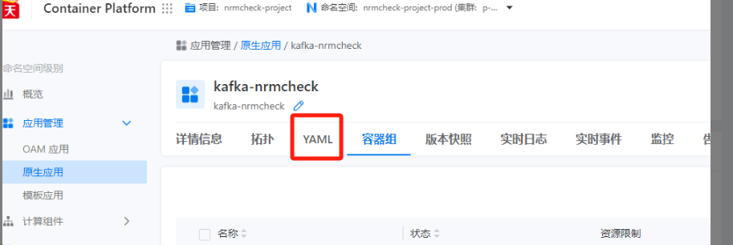

---
kind:
  - Troubleshooting
products:
  - Alauda Container Platform
  - Alauda DevOps
  - Alauda AI
  - Alauda Application Services
  - Alauda Service Mesh
  - Alauda Developer Portal
ProductsVersion:
  - 4.1.0,4.2.x
---
<!-- A type of document that involves encountering a fault, diagnosing it, performing root cause analysis, and providing solutions. -->

# 原生应用运行状态异常，但容器组运行状态正常，确认下是什么问题

原生应用状态显示异常/错误 实际容器组（Pod）运行状态正常

## Cause
- 原生应用在创建或更新时失败导致状态未同步

## Resolution
- 重新更新受影响的原生应用

## [workaround]

## [Related Information]
**Screenshots**

- Environment: 3.18.1
- 原生应用配置
- YAML状态信息
- kafka组件
- es组件
- Component: kafka
- Page ID: 327811943
- Original Title: 容器平台-原生应用运行状态异常，但容器组运行状态正常，确认下是什么问题-112597
