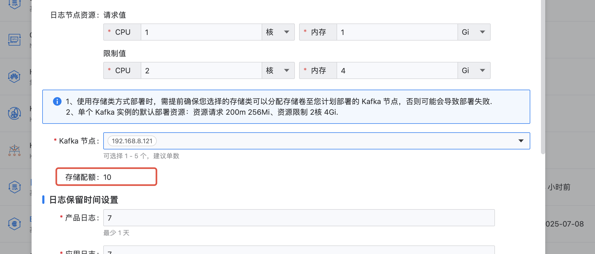

---
kind:
  - Troubleshooting
products:
  - Alauda Container Platform
  - Alauda DevOps
  - Alauda AI
  - Alauda Application Services
  - Alauda Service Mesh
  - Alauda Developer Portal
ProductsVersion:
  - 4.1.0,4.2.x
---
<!-- A type of document that involves encountering a fault, diagnosing it, performing root cause analysis, and providing solutions. -->

# 通过平台部署的ElasticSearch，kafka数据没有指定到对应目录

kafka数据没有指定到对应目录

## Cause
- zk和kafka的存储路径默认配置在/cpaas/data目录

## Resolution
- 迁移zk和Kafka目录到/es路径需通过4.0方案实现，3.18版本需联系pm走需求验证

## [workaround]

## [Related Information]
**Screenshots**

- Environment: 3.18.1版本，使用节点存储(非存储类)
- zk
- kafka
- /cpaas/data
- /es
- 存储类
- 节点存储
- Component: kafka
- Page ID: 327812009
- Original Title: 基础架构-通过平台部署的ElasticSearch，kafka数据没有指定到对应目录-114532
