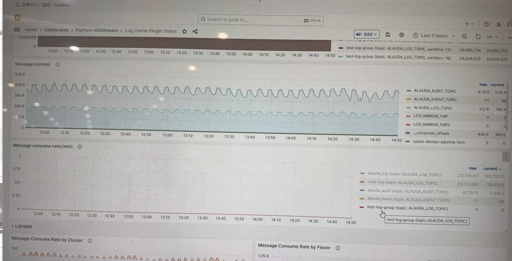
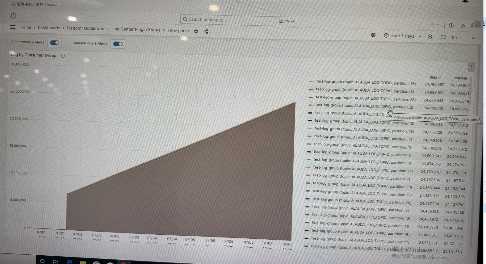

---
kind:
  - Troubleshooting
products:
  - Alauda Container Platform
  - Alauda DevOps
  - Alauda AI
  - Alauda Application Services
  - Alauda Service Mesh
  - Alauda Developer Portal
ProductsVersion:
  - 4.1.0,4.2.x
---
<!-- A type of document that involves encountering a fault, diagnosing it, performing root cause analysis, and providing solutions. -->

# 日志集群 kafka 消息持续堆积

kafka lag by consumer group 持续堆积 test-log-group topic 持续堆积未消费

## Cause
- test-log-group topic 为业务测试使用

## Resolution
- 确认测试用途后转交现场处理

## [workaround]

## [Related Information]
**Screenshots**

- Environment: 3.16.2
- test-log-group
- Component: kafka
- Page ID: 330465894
- Original Title: 基础架构-运维中心-日志事件审计-日志集群 kafka 消息持续堆积-112420
