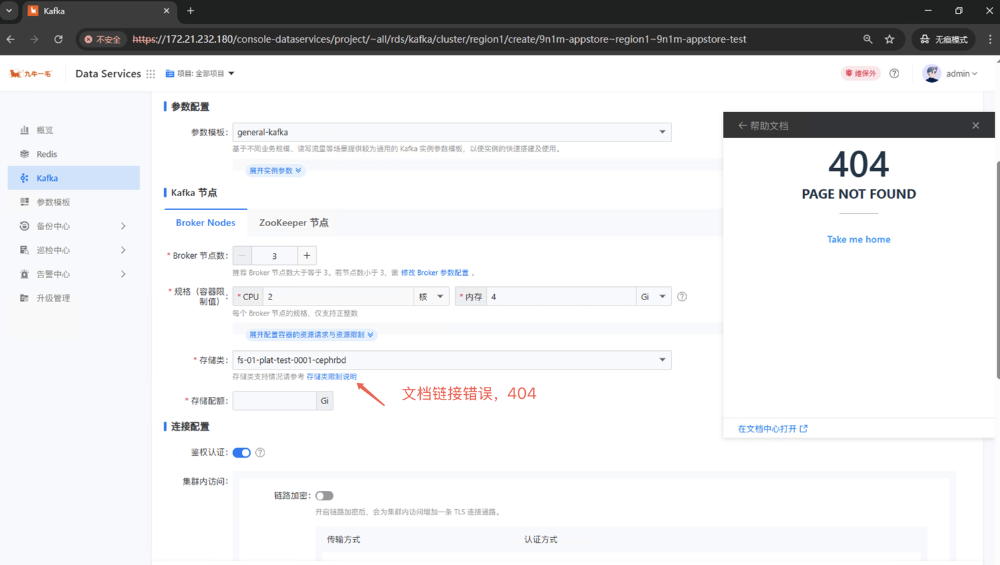
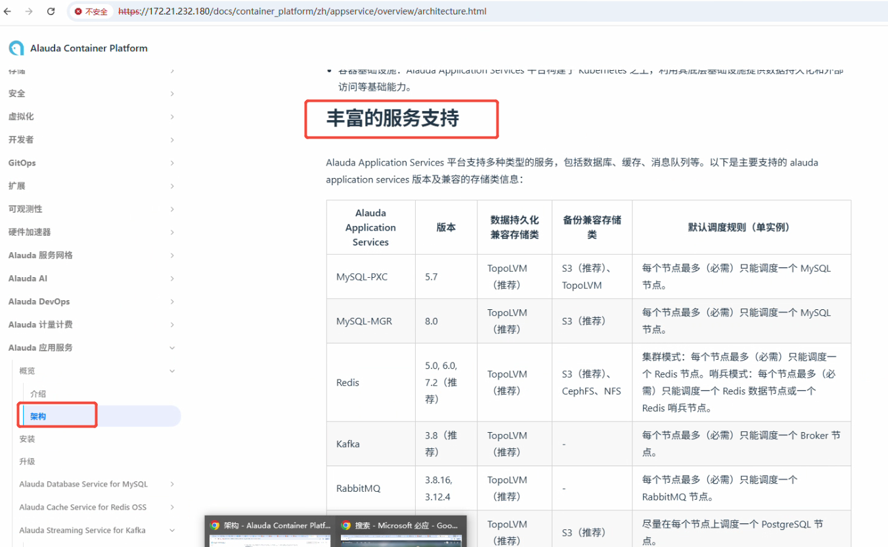

---
kind:
  - Troubleshooting
products:
  - Alauda Container Platform
  - Alauda DevOps
  - Alauda AI
  - Alauda Application Services
  - Alauda Service Mesh
  - Alauda Developer Portal
ProductsVersion:
  - 4.1.0,4.2.x
---
<!-- A type of document that involves encountering a fault, diagnosing it, performing root cause analysis, and providing solutions. -->

# 数据服务提示链接的文档地址404

kafka 实例中的'存储类限制'链接点击404

## Cause
- 在线帮助文档内容移动导致前端跳转链接失效

## Resolution
- 计划于下个小版本修复前端链接问题

## [workaround]
- 通过在线帮助文档-alauda应用服务-概览-架构-丰富的服务支持查看原内容

## [Related Information]
**Screenshots**

- Environment: 4.1.0
- kafka实例
- 存储类限制
- alauda应用服务
- 在线帮助文档
- Component: kafka
- Page ID: 341705010
- Original Title: 容器平台-产品组件-数据服务提示链接的文档地址404-116815
