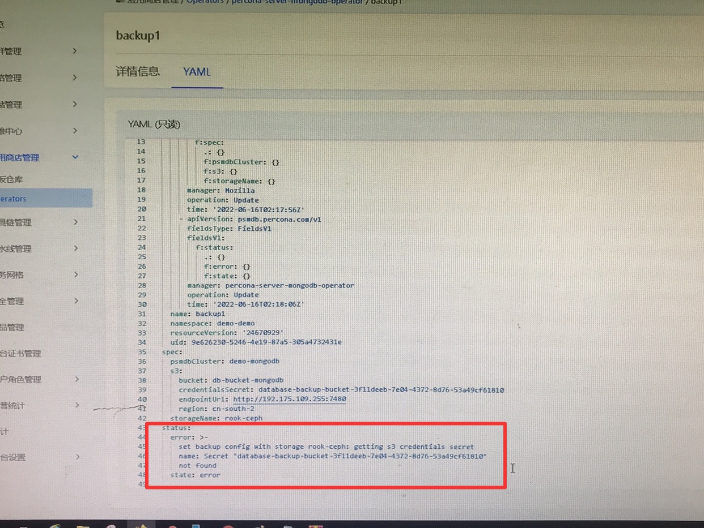
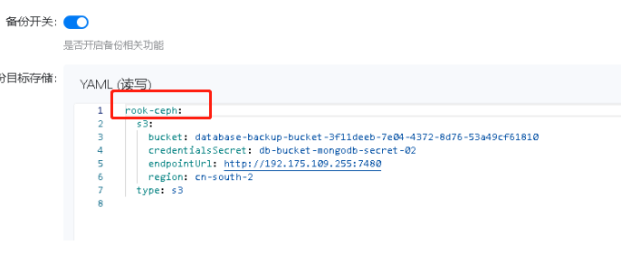
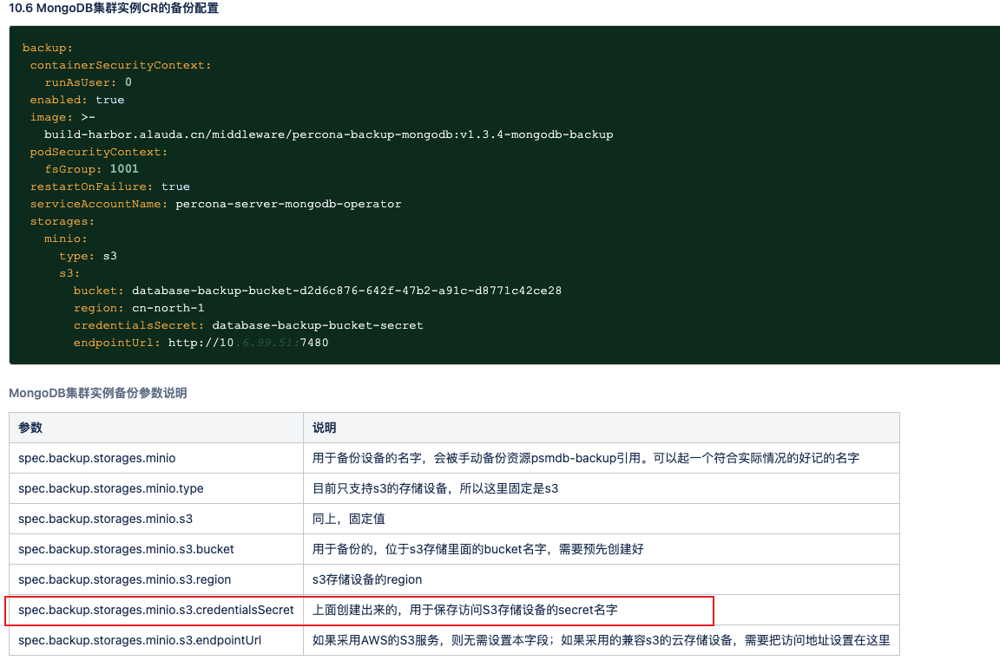
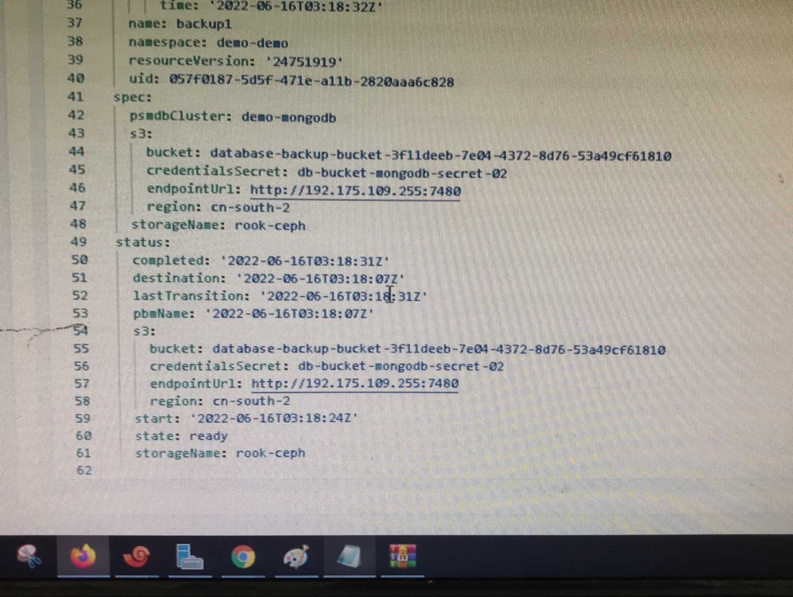

---
kind:
  - Troubleshooting
products:
  - Alauda Container Platform
  - Alauda DevOps
  - Alauda AI
  - Alauda Application Services
  - Alauda Service Mesh
  - Alauda Developer Portal
ProductsVersion:
  - 4.1.0,4.2.x
---
<!-- A type of document that involves encountering a fault, diagnosing it, performing root cause analysis, and providing solutions. -->

# 创建mongodb备份集群失败

备份cr的status字段为error 报错unable to get storage 'rook-ceph' 修正配置后报错获取secret失败

## Cause
- 备份字段yaml未正确使用storages字段
- 当前命名空间缺少访问s3的secret

## Resolution
- 修正备份cr的yaml配置字段为storages
- 手动创建s3访问secret并关联到备份cr

## [workaround]

## [Related Information]
**Screenshots**

- Environment: 3.8.1
- rook-ceph存储类
- secret资源
- storages字段配置
- s3访问凭证
- Component: mongodb
- Page ID: 115536862
- Original Title: 创建mongodb备份集群失败
