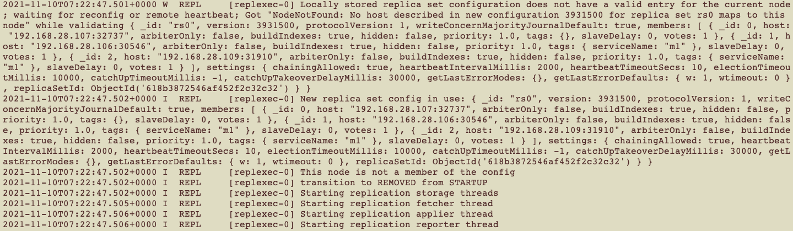

---
kind:
  - Troubleshooting
products:
  - Alauda Container Platform
  - Alauda DevOps
  - Alauda AI
  - Alauda Application Services
  - Alauda Service Mesh
  - Alauda Developer Portal
ProductsVersion:
  - 4.1.0,4.2.x
---
<!-- A type of document that involves encountering a fault, diagnosing it, performing root cause analysis, and providing solutions. -->

# Mongodb启动失败

健康检查一直失败 报错replSetGetStatus requires authentication 所有节点一直重启

## Cause
- 保存账户的secret(mongodb-j3-users)和Operator创建的内部secret(internal-j3-users)不一致

## Resolution
- 删除内部secret资源(internal-j3-users)促使Operator重建

## [workaround]

## [Related Information]
**Screenshots**

- Environment: 3.6.2
- mongodb-j3-users
- internal-j3-users
- Operator
- Component: mongodb
- Page ID: 120095034
- Original Title: Mongodb启动失败-健康检查一直失败，报错replSetGetStatus requires authentication
