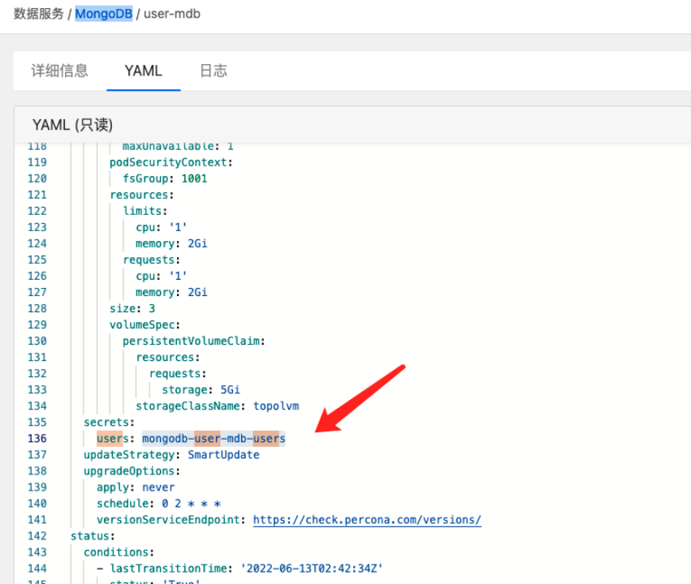
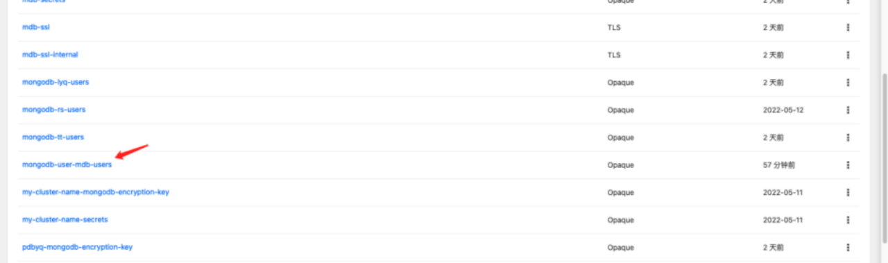
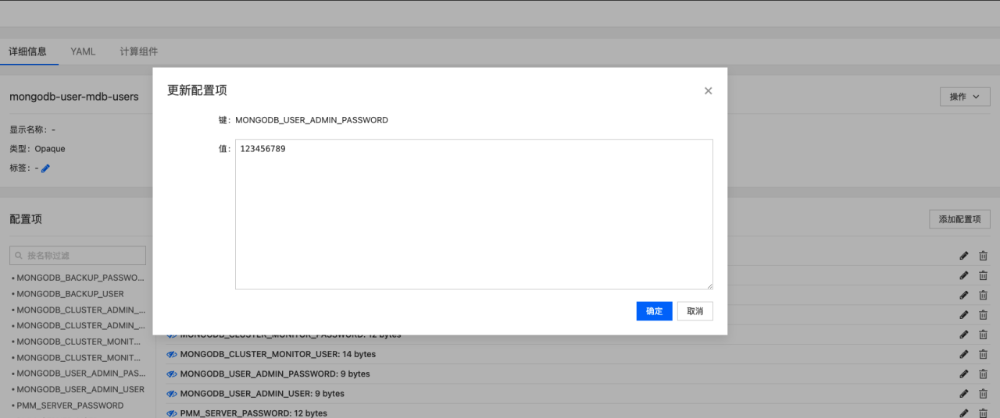
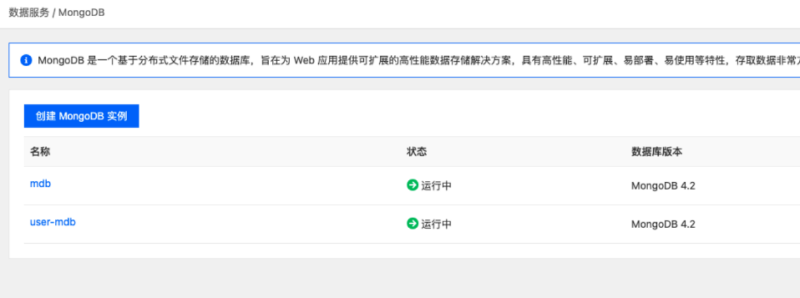
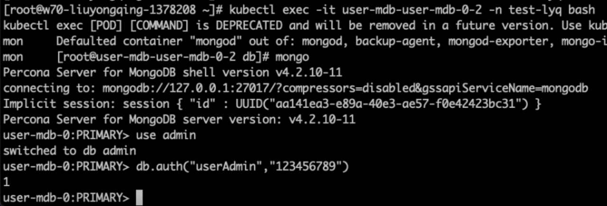

---
kind:
  - Troubleshooting
products:
  - Alauda Container Platform
  - Alauda DevOps
  - Alauda AI
  - Alauda Application Services
  - Alauda Service Mesh
  - Alauda Developer Portal
ProductsVersion:
  - 4.1.0,4.2.x
---
<!-- A type of document that involves encountering a fault, diagnosing it, performing root cause analysis, and providing solutions. -->

# mongodb修改userAdmin密码

备份数据失效 sasl conversation error: unable to authenticate using mechanism "SCRAM-SHA-256": (AuthenticationFailed) Authentication failed

## Cause
- 修改了MONGODB_BACKUP_PASSWORD或PMM_SERVER_PASSWORD密码
- Mongo集群状态非ready时操作

## Resolution
- 修改Secret中useradmin密码字段
- 等待1分钟观察实例状态
- 使用`kubectl exec -it user-mdb-user-mdb-0-2 -n test-lyq bash`连接验证新密码
- 检查operator日志认证错误

## [workaround]

## [Related Information]
**Screenshots**

- Environment: MongoDB 3.6.x/3.8.x/3.10.x/3.12.x
- Secret
- userAdmin
- MONGODB_BACKUP_PASSWORD
- PMM_SERVER_PASSWORD
- SCRAM-SHA-256
- Component: mongodb
- Page ID: 120095058
- Original Title: mongodb修改userAdmin密码
