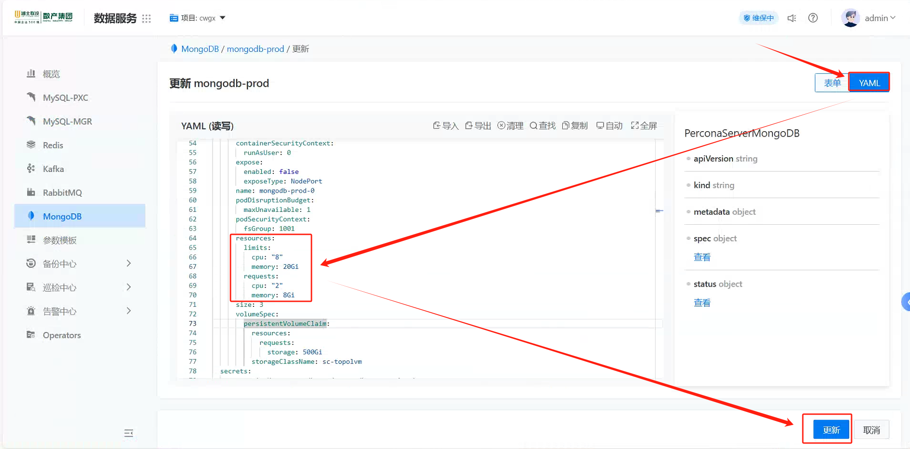

---
kind:
  - Troubleshooting
products:
  - Alauda Container Platform
  - Alauda DevOps
  - Alauda AI
  - Alauda Application Services
  - Alauda Service Mesh
  - Alauda Developer Portal
ProductsVersion:
  - 4.1.0,4.2.x
---
<!-- A type of document that involves encountering a fault, diagnosing it, performing root cause analysis, and providing solutions. -->

# mongodb 内存使用率高

MongoDB实例内存使用率持续高于90%

## Cause
- 工作集大小超过当前分配的内存容量
- 低效查询模式导致内存使用增加

## Resolution
- 增加MongoDB实例内存资源分配
- 优化查询模式并添加适当索引
- 调整wiredTigerCacheSizeGB参数
- 设置内存使用率监控告警阈值

## [workaround]

## [Related Information]
**Screenshots**

- Environment: v3.16.1
- wiredTigerCacheSizeGB
- Component: mongodb
- Page ID: 299139844
- Original Title: 数据服务-mongodb 内存使用率高-108781-zh
