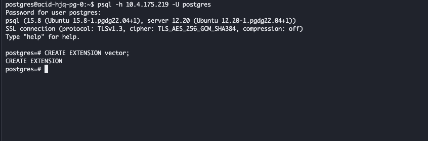

---
kind:
  - Troubleshooting
products:
  - Alauda Container Platform
  - Alauda DevOps
  - Alauda AI
  - Alauda Application Services
  - Alauda Service Mesh
  - Alauda Developer Portal
ProductsVersion:
  - 4.1.0,4.2.x
---
<!-- A type of document that involves encountering a fault, diagnosing it, performing root cause analysis, and providing solutions. -->

# PostgreSQL问题咨询

需要连接pg主节点执行创建命令 安装pgvector插件后需创建扩展和索引

## Cause
- 未正确使用psql连接主节点
- 未从secret获取认证信息
- 未配置索引参数

## Resolution
- psql -h <内部路由地址> -U <secret用户名> -d postgres
- CREATE EXTENSION vector;
- CREATE INDEX ON items USING ivfflat (embedding vector_l2_ops) WITH (lists = 100);
- SET ivfflat.probes = 10;
- CREATE INDEX ON items USING hnsw (embedding vector_l2_ops) WITH (m = 16, ef_construction = 64);
- SET hnsw.ef_search = 100;

## [workaround]
- 使用ALTER EXTENSION zhparser update升级插件

## [Related Information]
**Screenshots**

- Environment: 3.18.1
- psql
- vector
- ivfflat
- hnsw
- vector_l2_ops
- vector_ip_ops
- vector_cosine_ops
- ivfflat.probes
- hnsw.ef_search
- Component: postgresql
- Page ID: 345539015
- Original Title: 数据服务-数据服务-PostgreSQL-PostgreSQL问题咨询-117268
