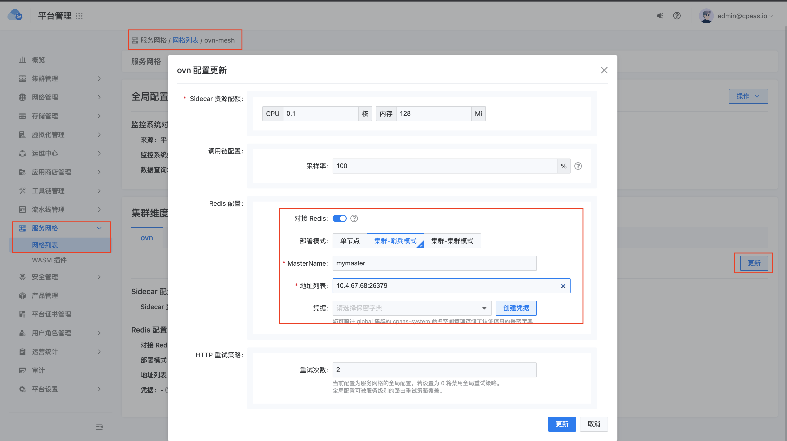
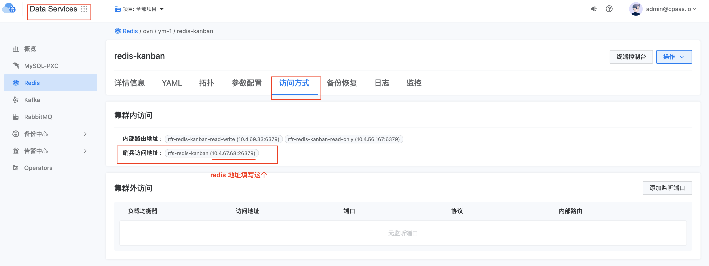

---
kind:
  - Troubleshooting
products:
  - Alauda Container Platform
  - Alauda DevOps
  - Alauda AI
  - Alauda Application Services
  - Alauda Service Mesh
  - Alauda Developer Portal
ProductsVersion:
  - 4.1.0,4.2.x
---
<!-- A type of document that involves encountering a fault, diagnosing it, performing root cause analysis, and providing solutions. -->

# 微服务应用创建限流策略不生效

微服务应用创建限流策略后可以无限访问

## Cause
- 未部署 Redis 哨兵
- 集群维度配置中 Redis 配置未启用或配置错误

## Resolution
- 在网格配置-集群维度配置中配置 MasterName 为 mymaster
- 地址填写数据服务中已部署 Redis 的哨兵访问地址

## [workaround]

## [Related Information]
**Screenshots**

- Redis哨兵
- 网格配置-集群维度配置
- MasterName
- Component: redis
- Page ID: 133082574
- Original Title: 微服务应用创建限流策略不生效
