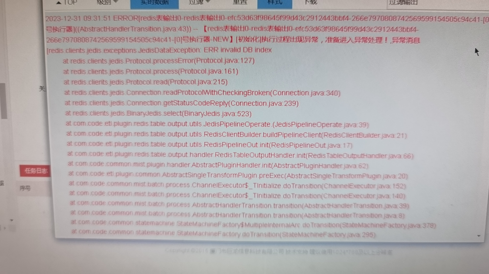

---
kind:
  - Troubleshooting
products:
  - Alauda Container Platform
  - Alauda DevOps
  - Alauda AI
  - Alauda Application Services
  - Alauda Service Mesh
  - Alauda Developer Portal
ProductsVersion:
  - 4.1.0,4.2.x
---
<!-- A type of document that involves encountering a fault, diagnosing it, performing root cause analysis, and providing solutions. -->

# v3.10

写入时报错ERR invalid DB index

## Cause
- redis集群模式默认仅支持数据库索引0，但业务配置使用了数据库索引

## Resolution
- 将redis存储区域配置从10更改为0

## [workaround]

## [Related Information]
**Screenshots**

- Environment: 3.10.1
- redis集群模式
- 数据库索引
- Jedis配置
- Component: redis
- Page ID: 231113008
- Original Title: v3.10-数据服务-redis连接正常，写入时报错
