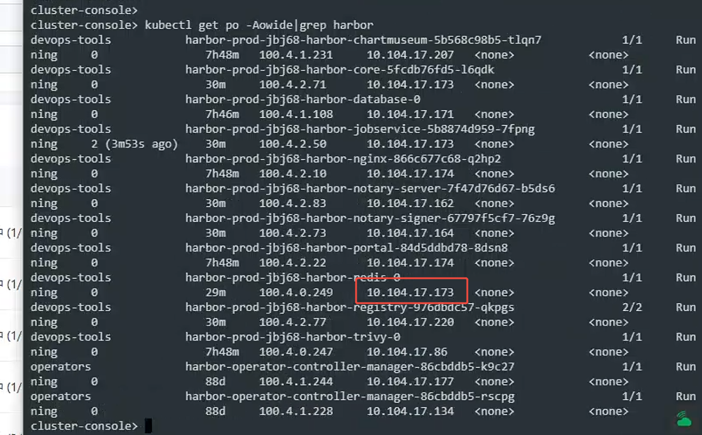
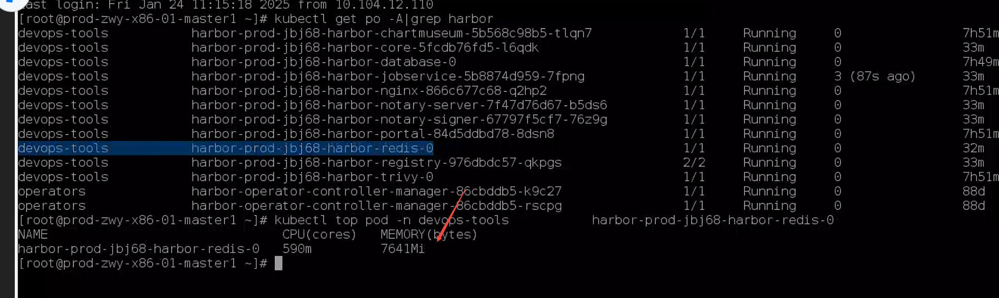
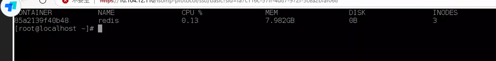

---
kind:
  - Troubleshooting
products:
  - Alauda Container Platform
  - Alauda DevOps
  - Alauda AI
  - Alauda Application Services
  - Alauda Service Mesh
  - Alauda Developer Portal
ProductsVersion:
  - 4.1.0,4.2.x
---
<!-- A type of document that involves encountering a fault, diagnosing it, performing root cause analysis, and providing solutions. -->

# prod redis重启后直接打满内存，而且修改redis资源不自动重启。

redis内存使用率过高，调大limit之后内存使用仍持续上涨 修改redis资源后不自动重启

## Cause
- harbor镜像同步任务产生的临时数据暂存redis缓存
- 同步任务数据量较大导致redis内存持续增长

## Resolution
- 关闭镜像同步任务
- 重启redis实例

## [workaround]

## [Related Information]
**Screenshots**

- Environment: Harbor 3.14.2
- 镜像同步任务
- redis缓存
- harbor资源限制配置
- Component: redis
- Page ID: 268536214
- Original Title: Devops-harbor-prod redis重启后直接打满内存，而且修改redis资源不自动重启。-100918
