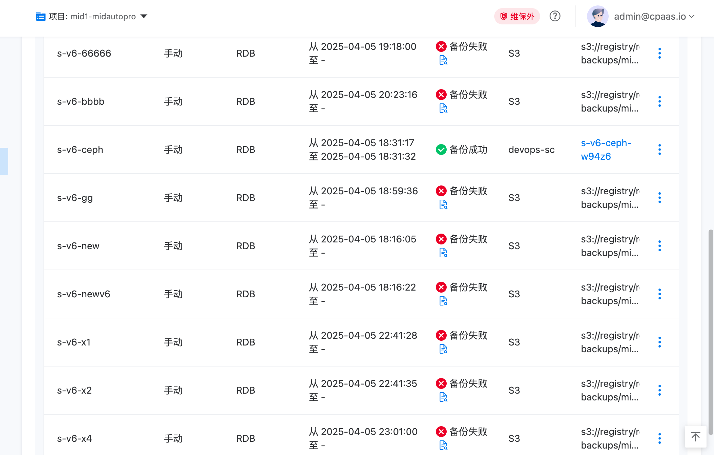
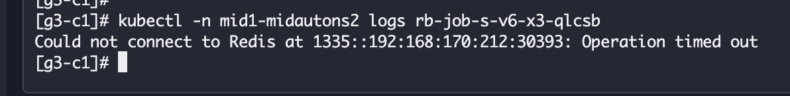
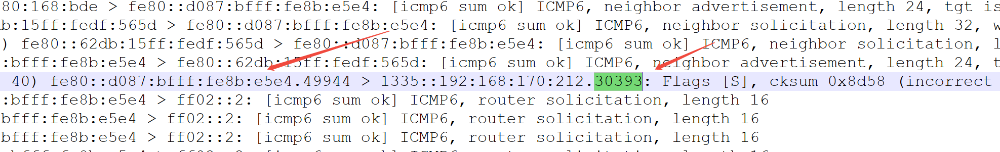
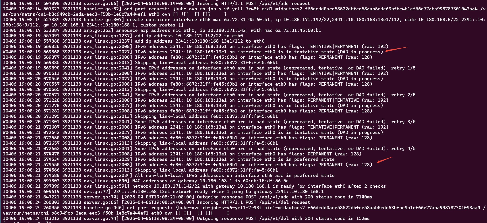
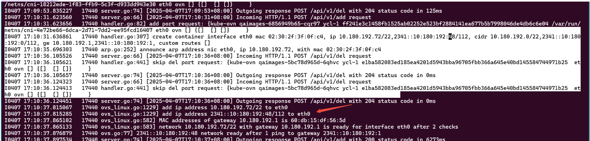
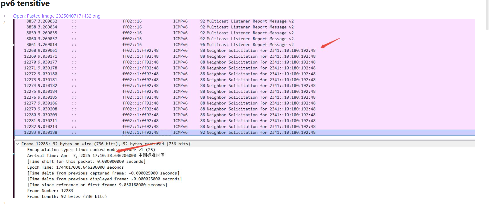
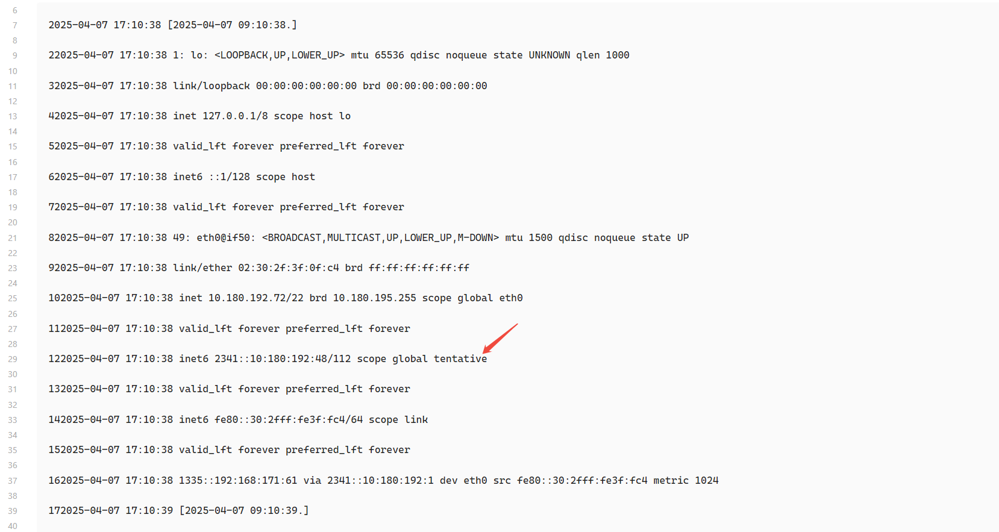
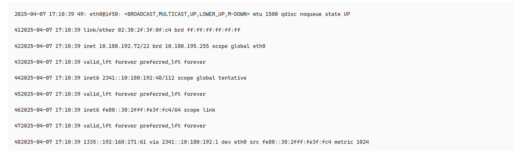

---
kind:
  - Troubleshooting
products:
  - Alauda Container Platform
  - Alauda DevOps
  - Alauda AI
  - Alauda Application Services
  - Alauda Service Mesh
  - Alauda Developer Portal
ProductsVersion:
  - 4.1.0,4.2.x
---
<!-- A type of document that involves encountering a fault, diagnosing it, performing root cause analysis, and providing solutions. -->

# redis 双栈情况下，访问外部v6地址偶现访问不通

redis 容器启动时访问外网 IPv6 地址偶发失败 业务 Pod 使用 fe80 的本地链路 IP 发送报文导致回报被丢弃

## Cause
- DAD 过程中地址处于 tentative 状态，优先使用本地链路地址发送报文
- Kube-OVN 在配置地址后未等待 DAD 完成即允许业务启动

## Resolution
- 升级至 kube-ovn 1.13.8 版本，应用修复补丁 https://github.com/kubeovn/kube-ovn/pull/5124

## [workaround]
- 调整内核参数 net.ipv6.conf.all.optimistic_dad=1 使地址直接可用（需评估网络冲突风险）

## [Related Information]
**Screenshots**

- Environment: Kubernetes (kube-ovn 1.13.6) + ACP 4.0
- IPv6 地址配置
- DAD 机制
- kube-ovn CNI
- net.ipv6.neigh.eth0.retrans_time_ms
- net.ipv6.conf.eth.dad_transmits
- Component: redis
- Page ID: 274710261
- Original Title: redis 双栈情况下，访问外部v6地址偶现访问不通
