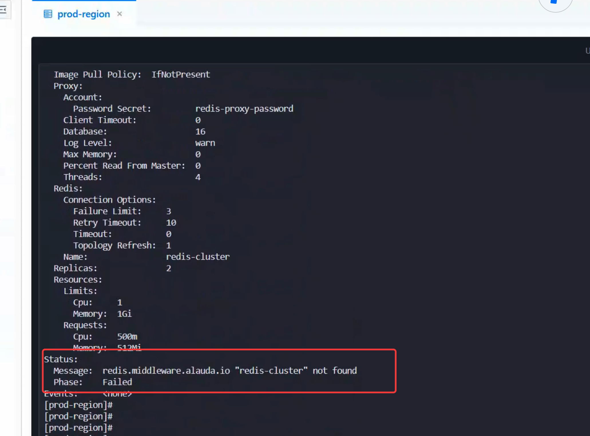
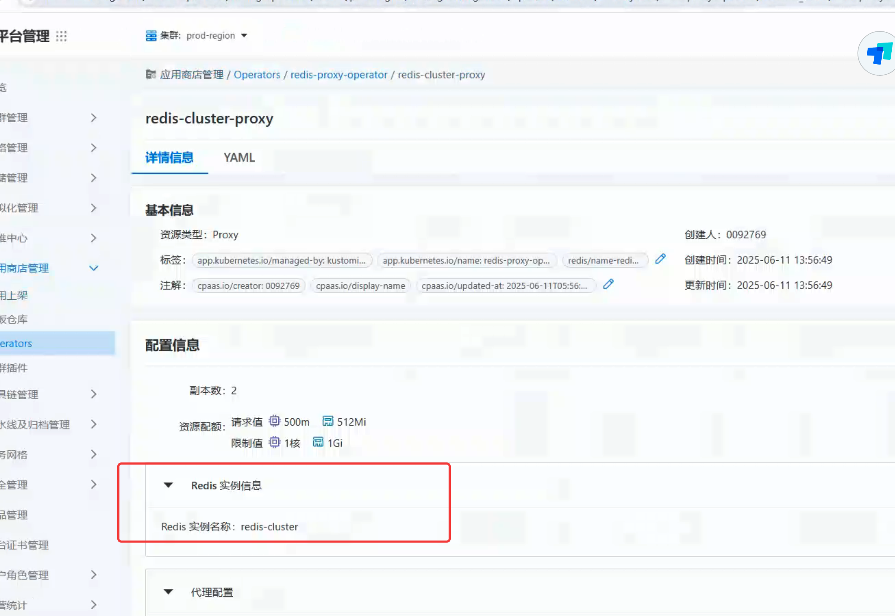

---
kind:
  - Troubleshooting
products:
  - Alauda Container Platform
  - Alauda DevOps
  - Alauda AI
  - Alauda Application Services
  - Alauda Service Mesh
  - Alauda Developer Portal
ProductsVersion:
  - 4.1.0,4.2.x
---
<!-- A type of document that involves encountering a fault, diagnosing it, performing root cause analysis, and providing solutions. -->

# proxy创建完找不到

无法找到创建的Redis实例

## Cause
- operator未正确安装或配置
- CRD未正确注册
- 用户权限不足
- 资源创建过程出现错误

## Resolution
- 检查operator pod状态及日志
- 执行`kubectl get crd`确认Redis CRD
- 验证Redis CR的yaml配置
- 使用`kubectl get all -n <namespace>`查看资源
- 添加RBAC权限

## [workaround]

## [Related Information]
**Screenshots**

- Environment: v3.16.1
- Redis CRD
- Redis CR
- StatefulSet
- Service
- RBAC权限
- kubectl context
- Component: redis
- Page ID: 311558514
- Original Title: 数据服务-redis-proxy创建完找不到-110440-zh
