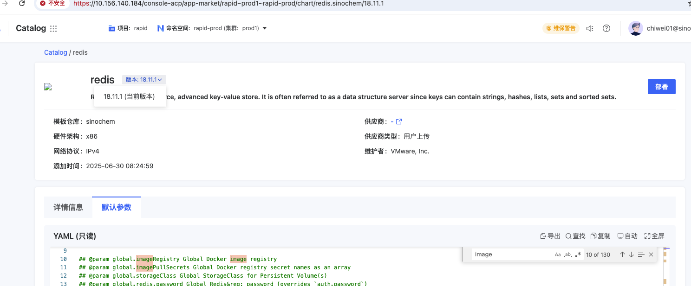

---
kind:
  - Troubleshooting
products:
  - Alauda Container Platform
  - Alauda DevOps
  - Alauda AI
  - Alauda Application Services
  - Alauda Service Mesh
  - Alauda Developer Portal
ProductsVersion:
  - 4.1.0,4.2.x
---
<!-- A type of document that involves encountering a fault, diagnosing it, performing root cause analysis, and providing solutions. -->

# cannot find version 17.3.7 for chart redis.sinoche

cannot find version 17.3.7 for chart redis.sinoche 持续报警但Redis仍运行

## Cause
- Chart仓库中不存在redis.sinoche的17.3.7版本
- 当前可用版本为18.11.1

## Resolution
- 将redis.sinoche的Chart版本更新至可用的18.11.1版本

## [workaround]

## [Related Information]
**Screenshots**

- Environment: 3.14.1
- redis.sinoche
- Helm Chart仓库
- version配置项
- Component: redis
- Page ID: 327811950
- Original Title: 容器平台-cannot find version 17.3.7 for chart redis.sinoche-112486
