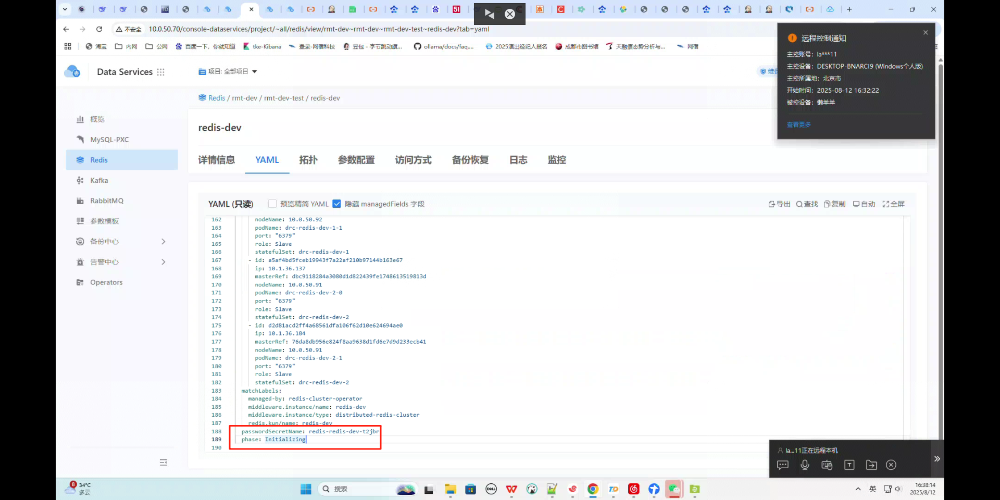
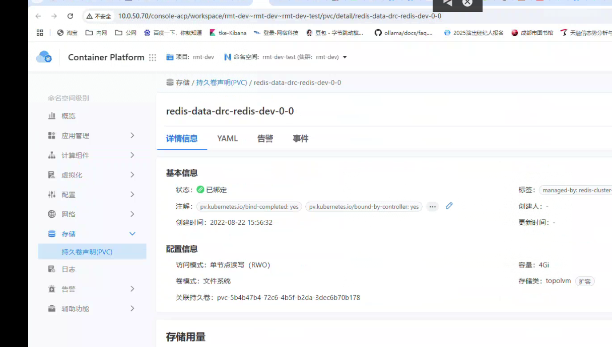

---
kind:
  - Troubleshooting
products:
  - Alauda Container Platform
  - Alauda DevOps
  - Alauda AI
  - Alauda Application Services
  - Alauda Service Mesh
  - Alauda Developer Portal
ProductsVersion:
  - 4.1.0,4.2.x
---
<!-- A type of document that involves encountering a fault, diagnosing it, performing root cause analysis, and providing solutions. -->

# redis集群状态显示不对

界面显示处理中，但实际redis已经启动成功 实例状态卡在初始化

## Cause
- 新建redis实例时使用了历史遗留的旧pvc

## Resolution
- 删除当前redis实例及关联的旧pvc
- 重新创建redis实例

## [workaround]

## [Related Information]
**Screenshots**

- Environment: 3.12.3
- pvc
- redis实例
- 网络策略
- Component: redis
- Page ID: 330465819
- Original Title: 数据服务-数据服务-Redis（哨兵/集群）-redis集群状态显示不对-114988
