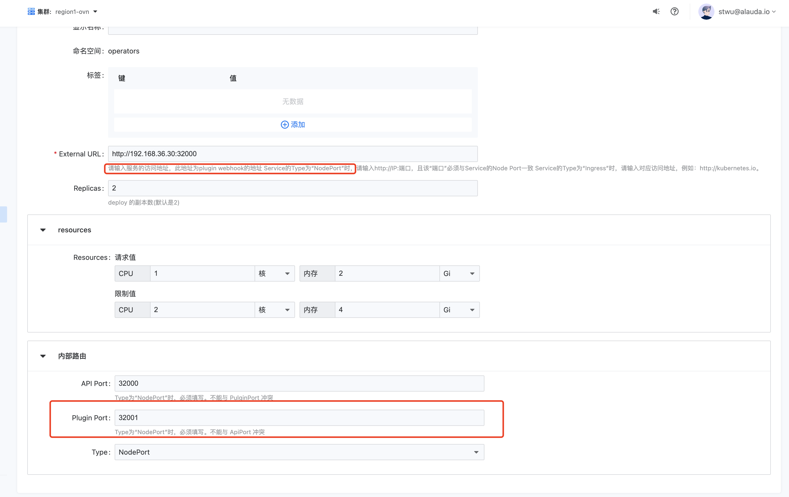

---
kind:
  - Troubleshooting
products:
  - Alauda Container Platform
  - Alauda DevOps
  - Alauda AI
  - Alauda Application Services
  - Alauda Service Mesh
  - Alauda Developer Portal
ProductsVersion:
  - 4.1.0,4.2.x
---
<!-- A type of document that involves encountering a fault, diagnosing it, performing root cause analysis, and providing solutions. -->

# 持续构建触发器不生效

持续构建配置触发器后没有生效 git仓库中webhook test push返回404状态

## Cause
- 业务集群部署katanomi时ExternalURL填写有误

## Resolution
- 检查并修正katanomi的ExternalURL配置，确保填写katanomi-plugin的地址（支持Ingress或NodePort方式）

## [workaround]

## [Related Information]
**Screenshots**

- Environment: TKE 3.8
- katanomi
- ExternalURL
- webhook
- Plugin Port
- Ingress
- NodePort
- Component: 持续构建
- Page ID: 130566046
- Original Title: 持续构建触发器不生效
