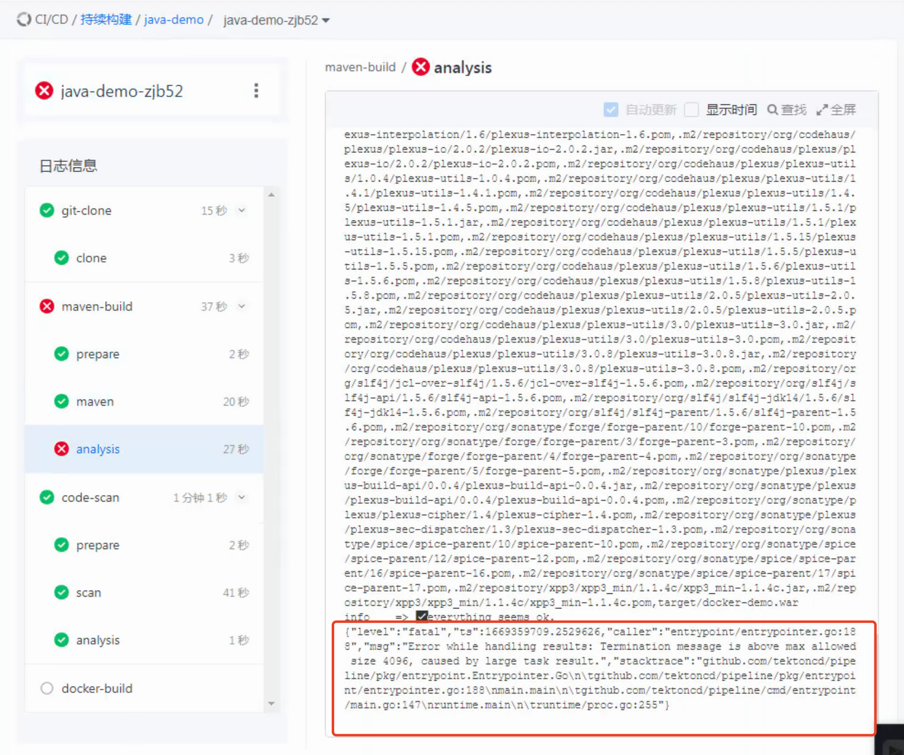

---
kind:
  - Troubleshooting
products:
  - Alauda Container Platform
  - Alauda DevOps
  - Alauda AI
  - Alauda Application Services
  - Alauda Service Mesh
  - Alauda Developer Portal
ProductsVersion:
  - 4.1.0,4.2.x
---
<!-- A type of document that involves encountering a fault, diagnosing it, performing root cause analysis, and providing solutions. -->

# 持续构建maven analysis阶段报错

Termination message is above max allowed size 4096 large task result

## Cause
- 存在.m2缓存目录导致结果数据超出Kubernetes容器终止消息限制(4096字节)
- Tekton使用JSON对象传递结果受大小限制

## Resolution
- 在git clone到workspace后执行构建命令时添加'rm -f .m2'删除缓存目录

## [workaround]

## [Related Information]
**Screenshots**

- Environment: TKE 3.10
- Tasks
- Kubernetes容器终止消息
- termeriting message
- step-maven
- mvn analyze
- Tekton结果传递机制
- Component: 持续构建
- Page ID: 130570523
- Original Title: 持续构建maven analysis阶段报错
