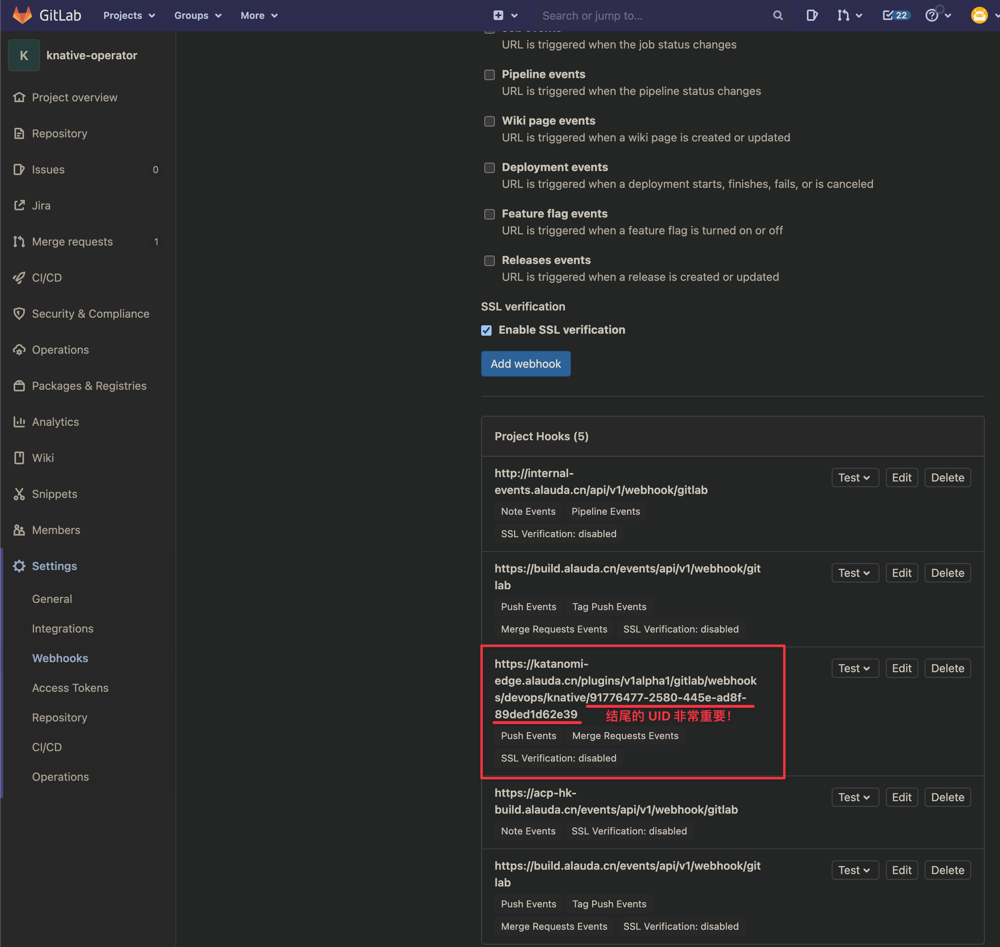

---
kind:
  - Troubleshooting
products:
  - Alauda Container Platform
  - Alauda DevOps
  - Alauda AI
  - Alauda Application Services
  - Alauda Service Mesh
  - Alauda Developer Portal
ProductsVersion:
  - 4.1.0,4.2.x
---
<!-- A type of document that involves encountering a fault, diagnosing it, performing root cause analysis, and providing solutions. -->

# 持续构建触发器不触发

持续构建时开启触发器更改git仓库代码不触发流水线

## Cause
- webhook配置异常

## Resolution
- 删除gitlab对应repo的webhook配置
- 重启katanomi-plugin pod重新生成webhook

## [workaround]

## [Related Information]
**Screenshots**

- Environment: TKE 3.8
- webhook
- katanomi-plugin
- 持续构建触发器
- Component: 持续构建
- Page ID: 130576484
- Original Title: 持续构建触发器不触发
