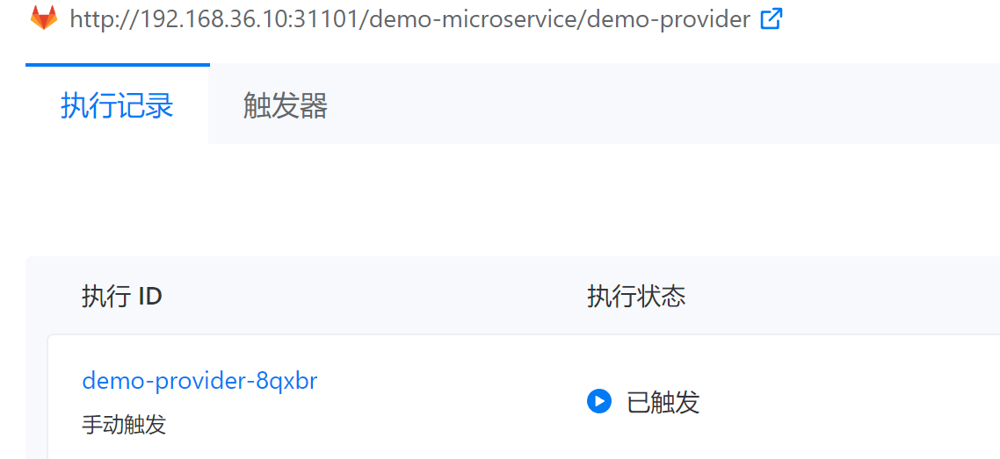

---
kind:
  - Troubleshooting
products:
  - Alauda Container Platform
  - Alauda DevOps
  - Alauda AI
  - Alauda Application Services
  - Alauda Service Mesh
  - Alauda Developer Portal
ProductsVersion:
  - 4.1.0,4.2.x
---
<!-- A type of document that involves encountering a fault, diagnosing it, performing root cause analysis, and providing solutions. -->

# 3.10.1

katanomi/knative-operator controller pods报错: x509证书不匹配webhook.operators.svc operators命名空间下webhook pod出现TLS错误 删除knative serving组件后buildrun资源直接失败

## Cause
- knative serving组件的webhook服务证书配置错误
- tekton-pipelines-webhook证书未包含webhook.operators.svc域名
- operators命名空间缺少webhook-certs证书

## Resolution
- 删除旧tekton实例并重新部署新实例

## [workaround]
- 临时删除knative serving组件可使katanomi/knative-operator恢复

## [Related Information]
**Screenshots**

- Environment: 3.10.1
- webhook.operators.svc
- knative serving组件
- tekton-pipelines-webhook
- webhook-certs证书
- operators命名空间
- Component: 持续构建
- Page ID: 133091972
- Original Title: 3.10.1-DevOps-持续构建执行已触发
