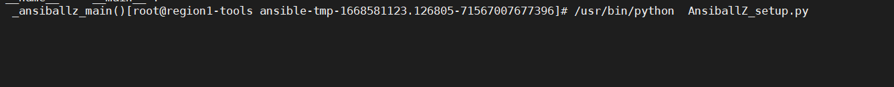
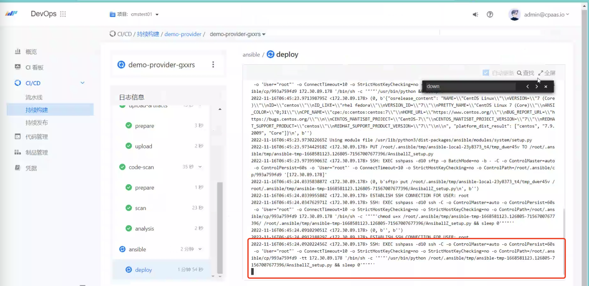

---
kind:
  - Troubleshooting
products:
  - Alauda Container Platform
  - Alauda DevOps
  - Alauda AI
  - Alauda Application Services
  - Alauda Service Mesh
  - Alauda Developer Portal
ProductsVersion:
  - 4.1.0,4.2.x
---
<!-- A type of document that involves encountering a fault, diagnosing it, performing root cause analysis, and providing solutions. -->

# 持续构建自定义ansible阶段执行缓慢

tekton流水线部署步骤通过ansible执行缓慢（15分钟） ansible执行playbook前ssh到节点执行AnsiballZ_setup.py时多次retry 手动执行AnsiballZ_setup.py报OS.error()涉及文件句柄操作

## Cause
- 节点ulimit -n设置过高（10w+）导致AnsiballZ_setup.py执行异常

## Resolution
- 调整ansible连接节点的ulimit值至65535

## [workaround]

## [Related Information]
**Screenshots**

- Environment: TKE 3.9
- ansible
- AnsiballZ_setup.py
- ssh
- ulimit
- Component: 持续构建
- Page ID: 133095017
- Original Title: 持续构建自定义ansible阶段执行缓慢
