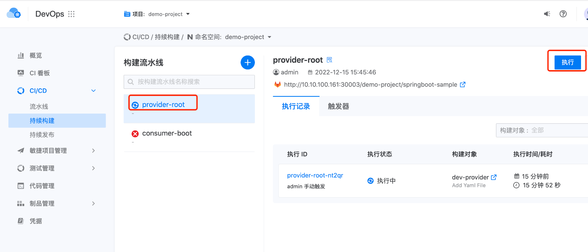
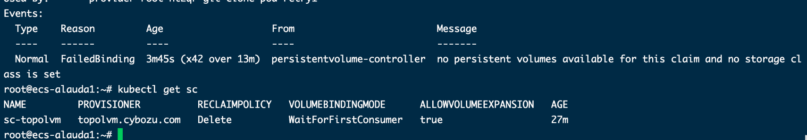

---
kind:
  - Troubleshooting
products:
  - Alauda Container Platform
  - Alauda DevOps
  - Alauda AI
  - Alauda Application Services
  - Alauda Service Mesh
  - Alauda Developer Portal
ProductsVersion:
  - 4.1.0,4.2.x
---
<!-- A type of document that involves encountering a fault, diagnosing it, performing root cause analysis, and providing solutions. -->

# 持续构建pod无法运行

持续构建pod无法运行 pod事件报错: no persistent volumes available for this claim is set

## Cause
- 环境未设置默认存储类(storageclass)

## Resolution
- 为集群设置默认存储类，执行命令：kubectl annotate storageclass [存储类名称] storageclass.kubernetes.io/is-default-class=true

## [workaround]

## [Related Information]
**Screenshots**

- Environment: TKE 3.6 以上
- storageclass
- persistentvolumeclaim
- tekton
- devops
- Component: 持续构建
- Page ID: 140806020
- Original Title: 持续构建pod无法运行
