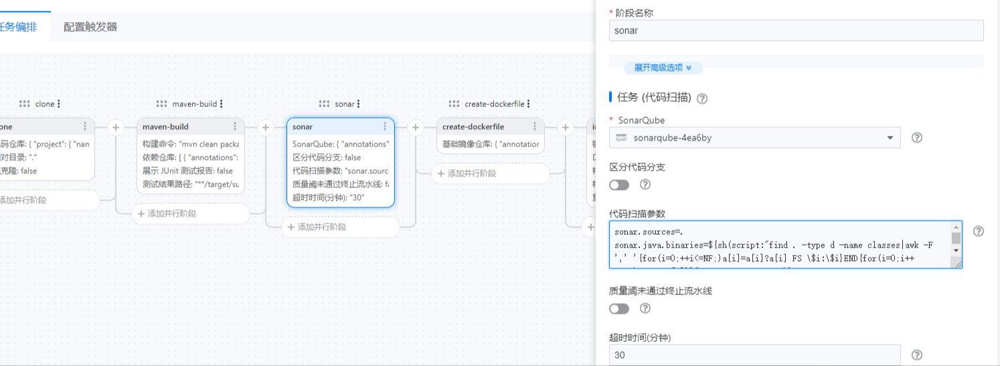
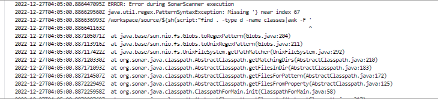

---
kind:
  - Troubleshooting
products:
  - Alauda Container Platform
  - Alauda DevOps
  - Alauda AI
  - Alauda Application Services
  - Alauda Service Mesh
  - Alauda Developer Portal
ProductsVersion:
  - 4.1.0,4.2.x
---
<!-- A type of document that involves encountering a fault, diagnosing it, performing root cause analysis, and providing solutions. -->

# 使用持续构建动态获取sonarqube代码目录

迁移到Tekton后sonar阶段报错，无法识别扫描参数sonar.java.binaries 动态获取classes目录失败

## Cause
- maven-build task无法导出对应的class目录
- Tekton流水线中直接使用Jenkinsfile的shell语法不兼容

## Resolution
- 增加inline task通过执行命令动态获取class目录并输出结果
- 在后续task中使用$(tasks.output-class-path.results.class-path)引用该路径

## [workaround]

## [Related Information]
**Screenshots**

- Environment: TKE 3.8以上
- sonar.java.binaries
- maven-build task
- inline task
- results.class-path.path
- workspaces.source.path
- Component: 持续构建
- Page ID: 140806542
- Original Title: 使用持续构建动态获取sonarqube代码目录
