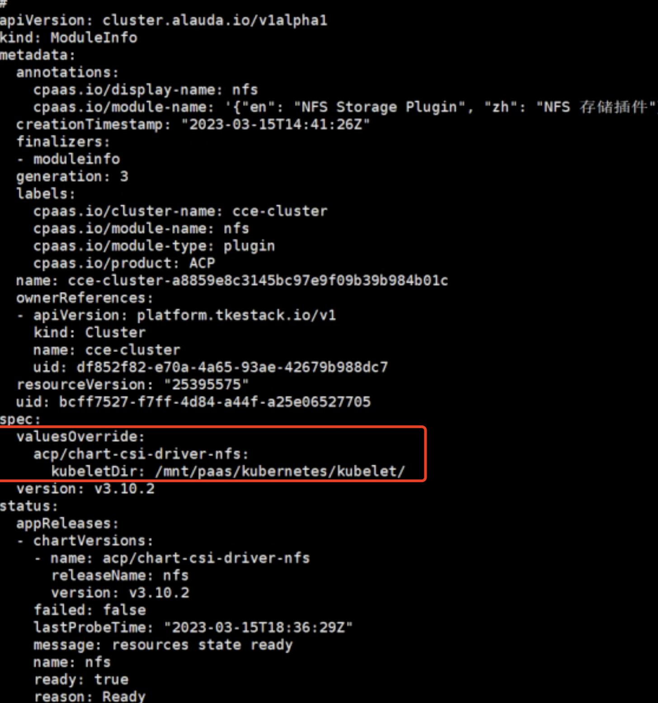

---
kind:
  - Troubleshooting
products:
  - Alauda Container Platform
  - Alauda DevOps
  - Alauda AI
  - Alauda Application Services
  - Alauda Service Mesh
  - Alauda Developer Portal
ProductsVersion:
  - 4.1.0,4.2.x
---
<!-- A type of document that involves encountering a fault, diagnosing it, performing root cause analysis, and providing solutions. -->

# 使用cce集群持续构建找不到pom文件

持续构建报找不到pom文件 容器内无clone的代码信息 容器内无nfs挂载信息

## Cause
- csi-driver-nfs默认kubeletDir配置(/var/lib/kubelet)与CCE实际工作目录(/mnt/paas/kubernetes/kubelet)不一致

## Resolution
- 修改csi-driver-nfs的kubeletDir配置为/mnt/paas/kubernetes/kubelet

## [workaround]

## [Related Information]
**Screenshots**

- Environment: CCE集群，使用外部部署的NFS服务器
- nfs server
- csi-driver-nfs
- kubeletDir配置
- PVC
- /mnt/paas/kubernetes/kubelet
- Component: 持续构建
- Page ID: 140834581
- Original Title: 使用cce集群持续构建找不到pom文件
