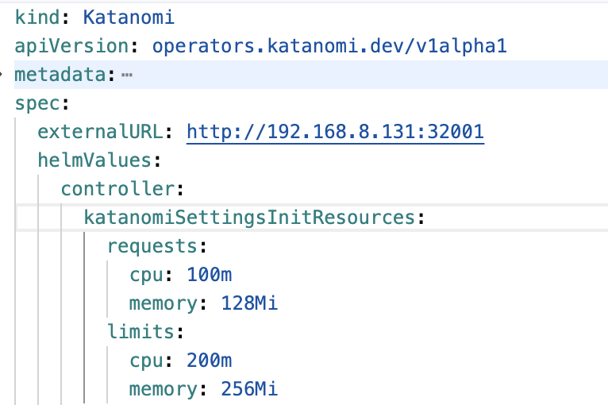
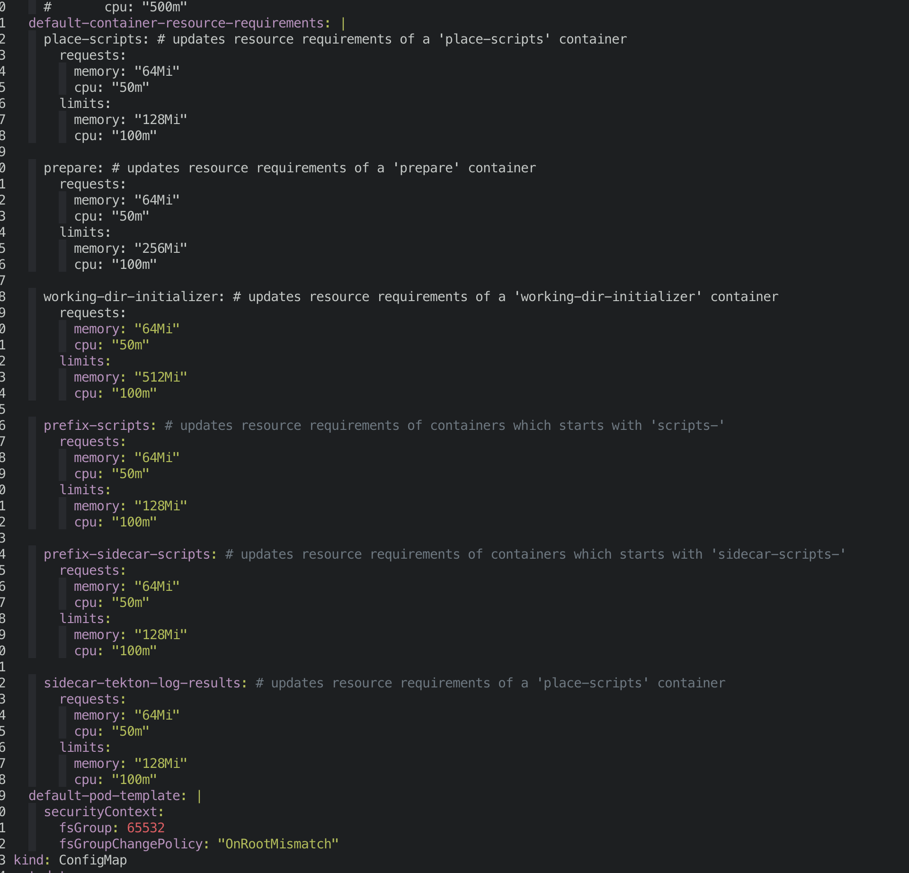

---
kind:
  - Troubleshooting
products:
  - Alauda Container Platform
  - Alauda DevOps
  - Alauda AI
  - Alauda Application Services
  - Alauda Service Mesh
  - Alauda Developer Portal
ProductsVersion:
  - 4.1.0,4.2.x
---
<!-- A type of document that involves encountering a fault, diagnosing it, performing root cause analysis, and providing solutions. -->

# 如何修改持续构建阶段pod中的initContainer容器资源

阶段执行缓慢 initContainer容器OOM

## Cause
- initContainer容器资源不足

## Resolution
- 修改helmValues中controller.katanomiSettingsInitResources字段配置
- 执行kubectl edit configmap -n tekton-pipelines config-defaults调整资源限制

## [workaround]

## [Related Information]
**Screenshots**

- Environment: 3.18
- katanomiSettingsInitResources
- config-defaults
- tekton-pipelines
- controller.helmValues
- Component: 持续构建
- Page ID: 308806180
- Original Title: 如何修改持续构建阶段pod中的initContainer容器资源
