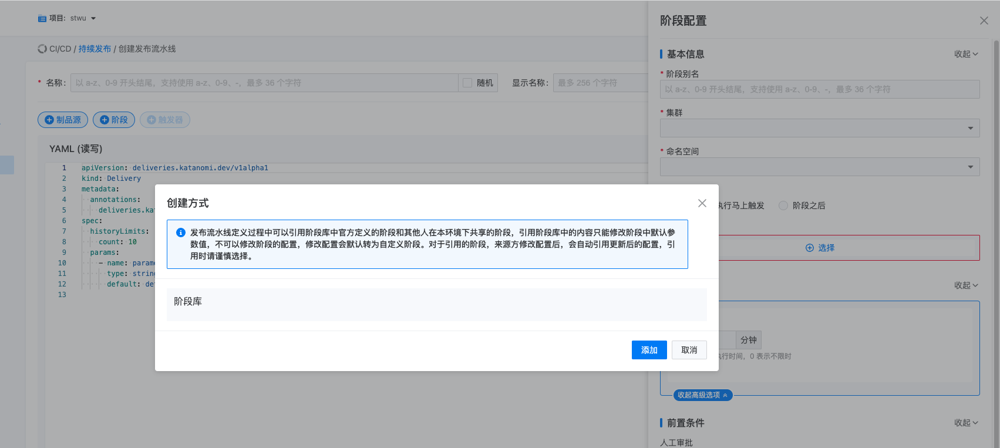
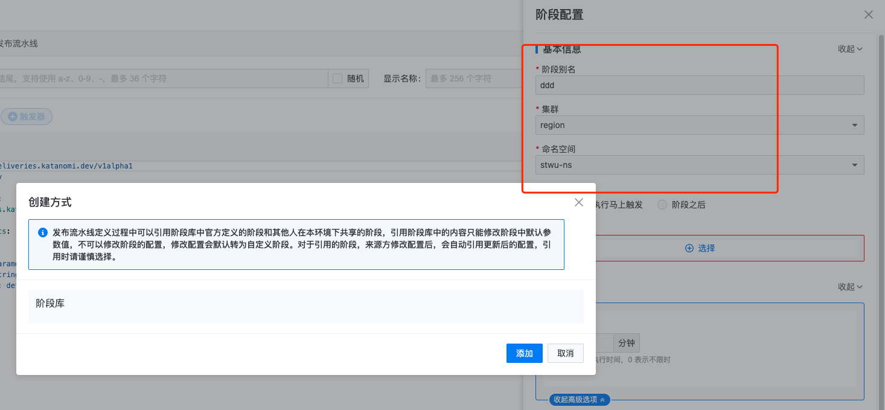
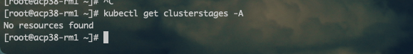

---
kind:
  - Troubleshooting
products:
  - Alauda Container Platform
  - Alauda DevOps
  - Alauda AI
  - Alauda Application Services
  - Alauda Service Mesh
  - Alauda Developer Portal
ProductsVersion:
  - 4.1.0,4.2.x
---
<!-- A type of document that involves encountering a fault, diagnosing it, performing root cause analysis, and providing solutions. -->

# 3.8.1

创建持续发布流水线选择添加阶段时阶段库为空 kubectl get clusterstages -A无资源

## Cause
- 未安装katanomi和tekton实例

## Resolution
- 在对应集群安装katanomi和tekton实例

## [workaround]

## [Related Information]
**Screenshots**

- Environment: TKE3.8.1
- clusterstages
- katanomi
- tekton
- Component: 持续发布
- Page ID: 124696454
- Original Title: 3.8.1-持续发布不显示阶段库
