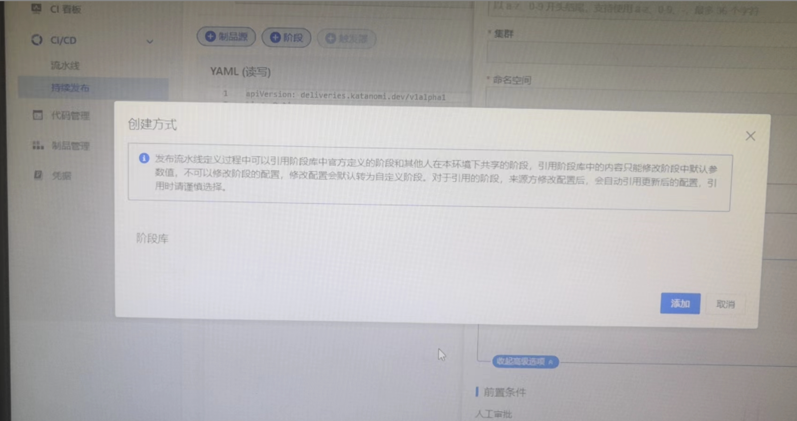

---
kind:
  - Troubleshooting
products:
  - Alauda Container Platform
  - Alauda DevOps
  - Alauda AI
  - Alauda Application Services
  - Alauda Service Mesh
  - Alauda Developer Portal
ProductsVersion:
  - 4.1.0,4.2.x
---
<!-- A type of document that involves encountering a fault, diagnosing it, performing root cause analysis, and providing solutions. -->

# 持续发布阶段库无数据

持续发布阶段库无数据 无法创建持续发布

## Cause
- 未安装katanomi operator和tekton operator
- 未部署katanomis和tektonpipeline实例

## Resolution
- 安装katanomi operator与tekton operator
- 部署katanomis和tektonpipeline实例

## [workaround]

## [Related Information]
**Screenshots**

- Environment: TKE 3.8
- clusterstages资源
- katanomi operator
- tekton operator
- katanomis实例
- tektonpipeline实例
- Component: 持续发布
- Page ID: 130576855
- Original Title: 持续发布阶段库无数据
