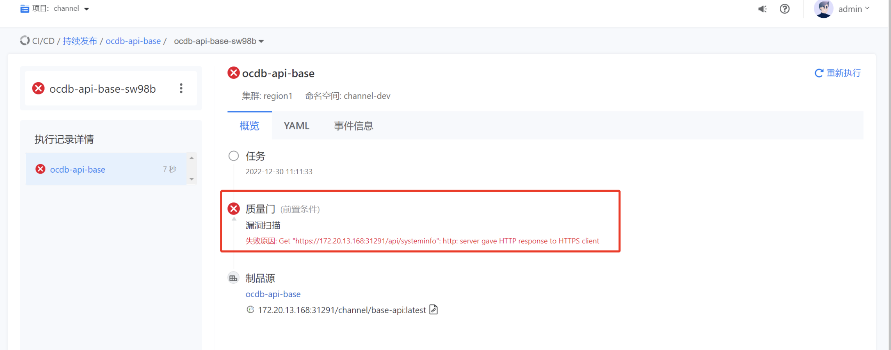
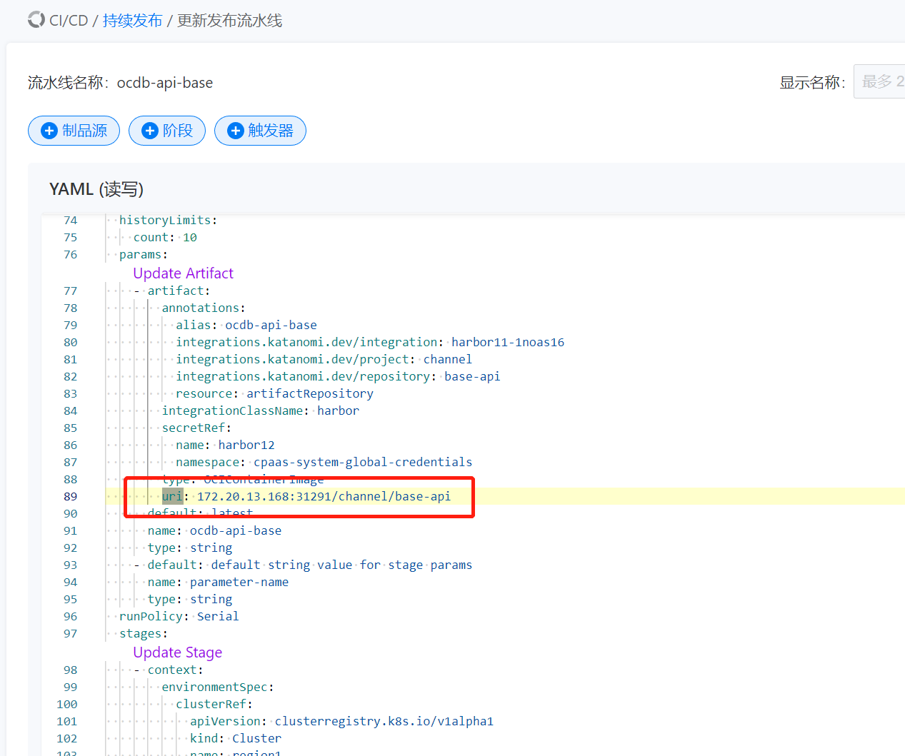

---
kind:
  - Troubleshooting
products:
  - Alauda Container Platform
  - Alauda DevOps
  - Alauda AI
  - Alauda Application Services
  - Alauda Service Mesh
  - Alauda Developer Portal
ProductsVersion:
  - 4.1.0,4.2.x
---
<!-- A type of document that involves encountering a fault, diagnosing it, performing root cause analysis, and providing solutions. -->

# 持续发布扫描镜像漏洞失败

执行镜像扫描时报错，http镜像仓库被识别为https

## Cause
- 流水线错误将http协议镜像仓库识别为https协议

## Resolution
- 在镜像仓库配置中显式添加http://协议前缀

## [workaround]

## [Related Information]
**Screenshots**

- Environment: 3.10.1
- harbor协议配置
- 镜像仓库地址配置
- Component: 持续发布
- Page ID: 133094394
- Original Title: devops-持续发布扫描镜像漏洞失败
