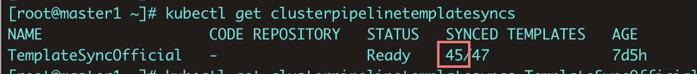

---
kind:
  - Troubleshooting
products:
  - Alauda Container Platform
  - Alauda DevOps
  - Alauda AI
  - Alauda Application Services
  - Alauda Service Mesh
  - Alauda Developer Portal
ProductsVersion:
  - 4.1.0,4.2.x
---
<!-- A type of document that involves encountering a fault, diagnosing it, performing root cause analysis, and providing solutions. -->

# 3.8.1新环境部署，偶现主集群缺失clusterpipelinetemplates资源

主集群clusterpipelinetemplates资源同步数目小于45

## Cause
- task模板导入异常阻塞后续pipeline模板导入流程

## Resolution
- 重启global集群cpaas-system命名空间下的devops-controller组件

## [workaround]

## [Related Information]
**Screenshots**

- Environment: 3.8.1/3.8.0
- clusterpipelinetemplatesyncs
- TemplateSyncOfficial
- devops-controller
- cpaas-system
- Component: Pipeline
- Page ID: 115508198
- Original Title: 3.8.1新环境部署，偶现主集群缺失clusterpipelinetemplates资源
