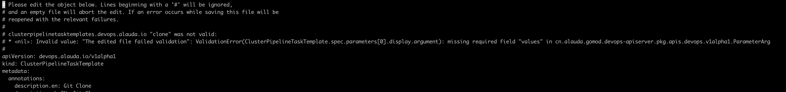
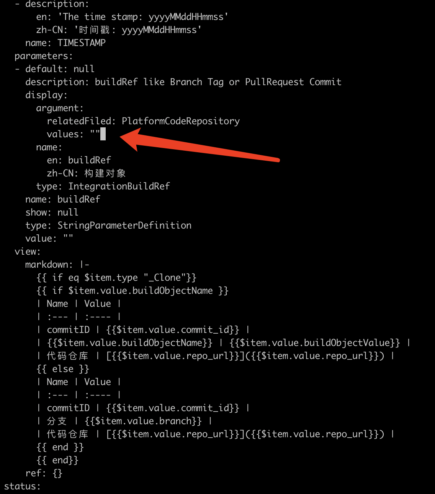

---
kind:
  - Troubleshooting
products:
  - Alauda Container Platform
  - Alauda DevOps
  - Alauda AI
  - Alauda Application Services
  - Alauda Service Mesh
  - Alauda Developer Portal
ProductsVersion:
  - 4.1.0,4.2.x
---
<!-- A type of document that involves encountering a fault, diagnosing it, performing root cause analysis, and providing solutions. -->

# 保存流水线官方模版报错

保存流水线官方模版时报错：ClusterPipelineTaskTemplate.spec.parameters[0].display.argument 的 "values" 字段缺失

## Cause
- ClusterPipelineTaskTemplate.spec.parameters[0].display.argument.values 字段默认值为 null，但系统要求该字段必须存在

## Resolution
- 将 ClusterPipelineTaskTemplate.spec.parameters[0].display.argument.values 字段值从 null 改为空字符串 ""

## [workaround]

## [Related Information]
**Screenshots**

- Environment: TKE 3.6.x, TKE 3.8.x
- ClusterPipelineTaskTemplate.spec.parameters.display.argument.values
- Component: 流水线
- Page ID: 115514627
- Original Title: 保存流水线官方模版报错
