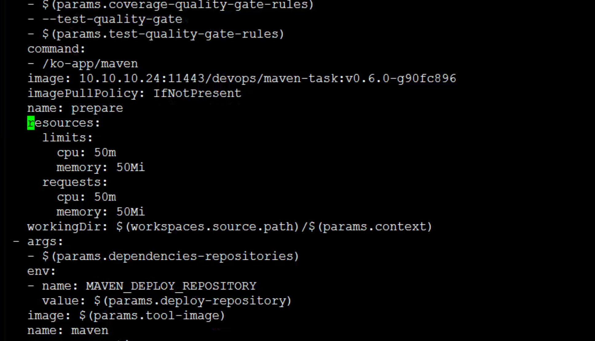

---
kind:
  - Troubleshooting
products:
  - Alauda Container Platform
  - Alauda DevOps
  - Alauda AI
  - Alauda Application Services
  - Alauda Service Mesh
  - Alauda Developer Portal
ProductsVersion:
  - 4.1.0,4.2.x
---
<!-- A type of document that involves encountering a fault, diagnosing it, performing root cause analysis, and providing solutions. -->

# 修改持续构建流水线pod配置

## 环境信息 适用版本：TKE 3.6.0以上

## Cause

## Resolution
- 修改clustertask.spec.steps[*]中对应steps的image/name字段，并在resources{}上下文添加或修改requests与limits配置

## [workaround]

## [Related Information]
**Screenshots**

- Environment: TKE 3.6.0以上
- clustertask
- spec.steps
- resources
- requests
- limits
- Component: 流水线
- Page ID: 115515742
- Original Title: 修改持续构建流水线pod配置
