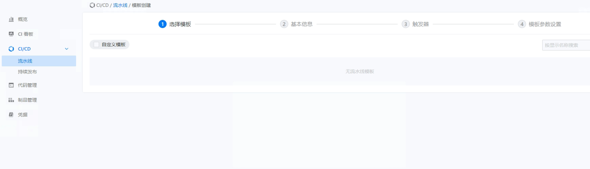

---
kind:
  - Troubleshooting
products:
  - Alauda Container Platform
  - Alauda DevOps
  - Alauda AI
  - Alauda Application Services
  - Alauda Service Mesh
  - Alauda Developer Portal
ProductsVersion:
  - 4.1.0,4.2.x
---
<!-- A type of document that involves encountering a fault, diagnosing it, performing root cause analysis, and providing solutions. -->

# 无流水线官方模板

创建流水线时不显示内置模板

## Cause
- task模板同步失败（可能由etcd超时导致）

## Resolution
- 重启devops-controller

## [workaround]

## [Related Information]
**Screenshots**

- Environment: 3.8.1
- ClusterPipelineTemplateSync
- ClusterPipelineTemplates
- devops-controller
- etcd
- Component: 流水线
- Page ID: 119088808
- Original Title: 无流水线官方模板
