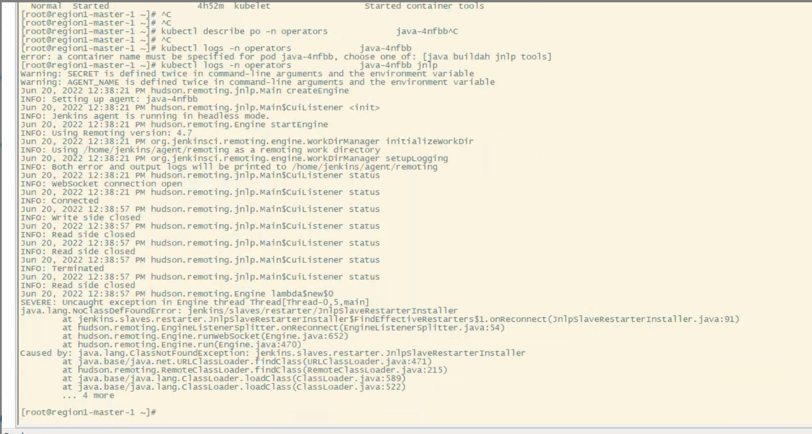
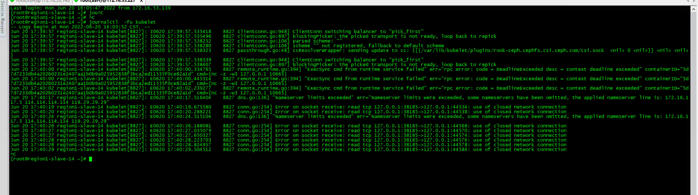
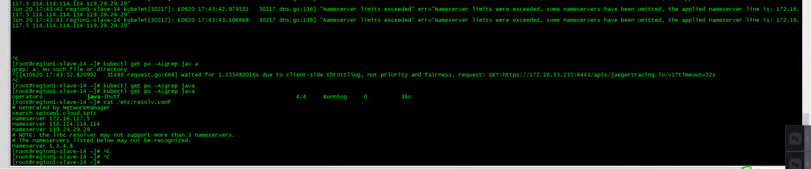

---
kind:
  - Troubleshooting
products:
  - Alauda Container Platform
  - Alauda DevOps
  - Alauda AI
  - Alauda Application Services
  - Alauda Service Mesh
  - Alauda Developer Portal
ProductsVersion:
  - 4.1.0,4.2.x
---
<!-- A type of document that involves encountering a fault, diagnosing it, performing root cause analysis, and providing solutions. -->

# 流水线报错Internal Server Error 500

jenkins slave调用kubernetes时kubelet返回500响应 kubelet日志存在use of network close错误 kubelet日志显示nameserver数量超过上限

## Cause
- kubelet存在已知BUG（use of network close错误）
- 服务器配置的nameserver数量超过上限（超过3个）

## Resolution
- 重启jenkins slave被调度的kubelet节点
- 删除未使用的nameserver配置，保持最多3个nameserver

## [workaround]

## [Related Information]
**Screenshots**

排查发现kubelet日志存在超出nameserver上限的问题，建议将服务器中没有用到的nameserver删除，最多保留3个nameserver，此问题可能会诱发kubelet的BUG
- Environment: 通用
- kubelet
- jenkins slave
- nameserver配置
- Component: 流水线
- Page ID: 120102397
- Original Title: 流水线报错Internal Server Error 500
