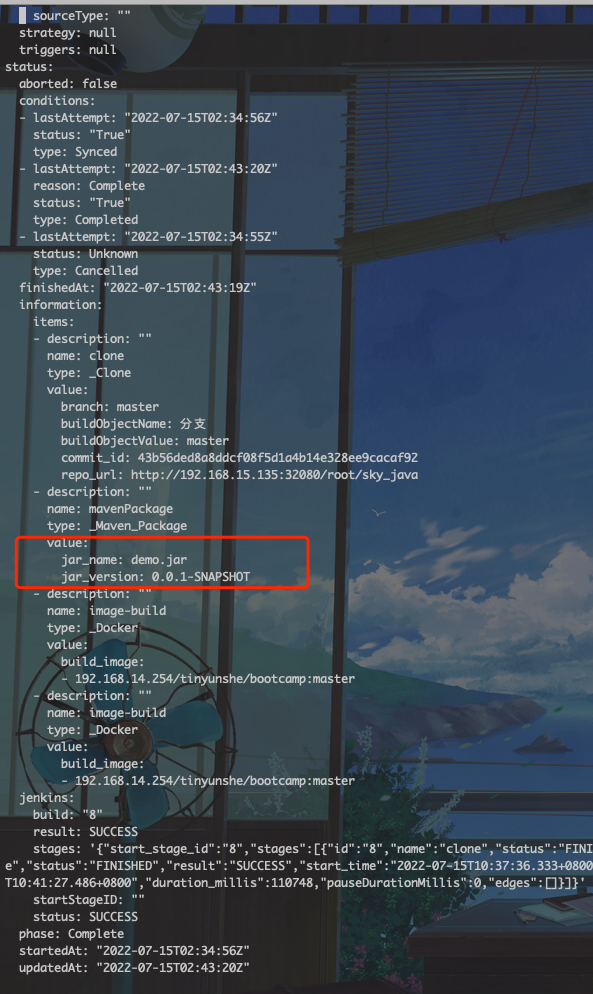

---
kind:
  - Troubleshooting
products:
  - Alauda Container Platform
  - Alauda DevOps
  - Alauda AI
  - Alauda Application Services
  - Alauda Service Mesh
  - Alauda Developer Portal
ProductsVersion:
  - 4.1.0,4.2.x
---
<!-- A type of document that involves encountering a fault, diagnosing it, performing root cause analysis, and providing solutions. -->

# mvn help:evaluate

mvn help:evaluate报空指针异常 无法获取project.version或project.artifactId值

## Cause
- pom.xml中未配置project.version或project.artifactId字段

## Resolution
- 在pom.xml中明确配置<version>和<artifactId>字段

## [workaround]

## [Related Information]
**Screenshots**

- Environment: 通用Maven版本
- pom.xml
- project.version
- project.artifactId
- mvn help:evaluate
- Component: 流水线
- Page ID: 120113124
- Original Title: mvn help:evaluate -Dexpression=project.artifactId -q -DforceStdout常见问题
