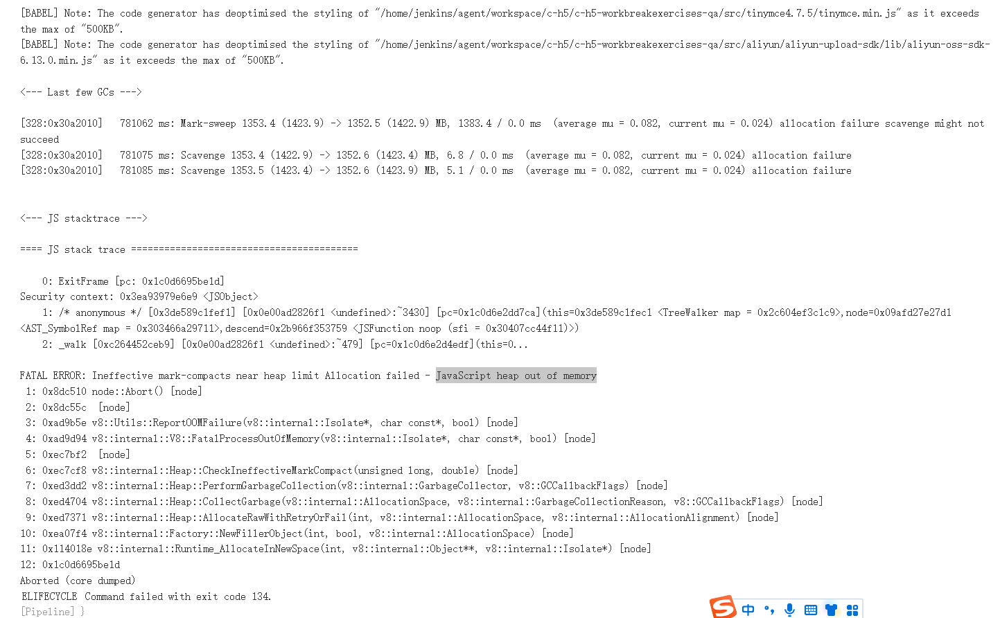

---
kind:
  - Troubleshooting
products:
  - Alauda Container Platform
  - Alauda DevOps
  - Alauda AI
  - Alauda Application Services
  - Alauda Service Mesh
  - Alauda Developer Portal
ProductsVersion:
  - 4.1.0,4.2.x
---
<!-- A type of document that involves encountering a fault, diagnosing it, performing root cause analysis, and providing solutions. -->

# nodejs流水线运行失败

流水线执行失败 javaScript heap out of memory 报错

## Cause
- Node.js 项目依赖分配的内存不足

## Resolution
- 将 nodejs 容器扩容内存限制

## [workaround]

## [Related Information]
**Screenshots**

- Environment: Node.js 环境
- --max-old-space-size
- Component: 流水线
- Page ID: 120115542
- Original Title: nodejs流水线运行失败
