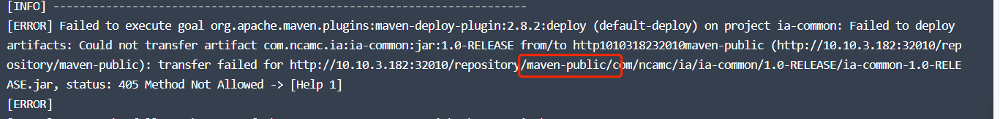

---
kind:
  - Troubleshooting
products:
  - Alauda Container Platform
  - Alauda DevOps
  - Alauda AI
  - Alauda Application Services
  - Alauda Service Mesh
  - Alauda Developer Portal
ProductsVersion:
  - 4.1.0,4.2.x
---
<!-- A type of document that involves encountering a fault, diagnosing it, performing root cause analysis, and providing solutions. -->

# 3.8.1

流水线使用图形化方式创建，maven分发模板，上传jar包失败，报错405 问题原因是对应的jar包版本应该上传到对应的版本库中，不能上传到group类型库中否则会报方法错误

## Cause

## Resolution
- ## 解决方案

## [workaround]

## [Related Information]
**Screenshots**

- 405
- //pro-upload-center.kefutoutiao.com/tid99781/1658816549_99781_3a92b1_2.png
- //pro-upload-center.kefutoutiao.com/tid99781/1658816549_99781_1b9e2e_1.png
- //pro-upload-center.kefutoutiao.com/tid99781/1658816549_99781_628537_3.png
- /3-8-1-mvnshang-chuan-bao-cuo-405/image_1658821878019_g7q78.png
- /3-8-1-mvnshang-chuan-bao-cuo-405/image_1658821882061_oh598.png
- Component: 流水线
- Page ID: 120121981
- Original Title: 3.8.1-mvn上传报错405
