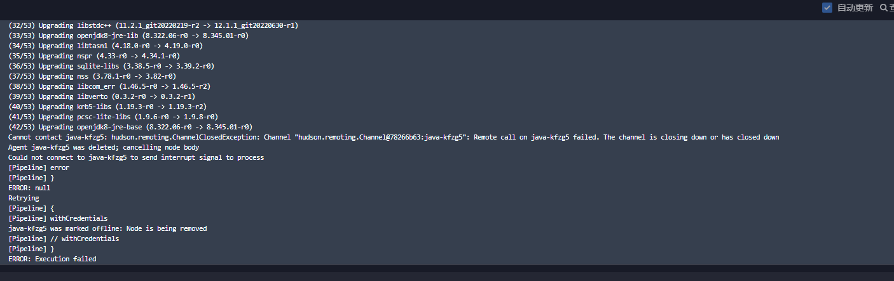

---
kind:
  - Troubleshooting
products:
  - Alauda Container Platform
  - Alauda DevOps
  - Alauda AI
  - Alauda Application Services
  - Alauda Service Mesh
  - Alauda Developer Portal
ProductsVersion:
  - 4.1.0,4.2.x
---
<!-- A type of document that involves encountering a fault, diagnosing it, performing root cause analysis, and providing solutions. -->

# 3.6.1

DevOps流水线构建失败 java pod调度主机磁盘使用率达到80%触发驱逐

## Cause
- 主机/var/lib/docker目录磁盘使用率过高

## Resolution
- 清理退出容器等资源
- 扩容主机/var/lib/docker目录并单独挂盘（建议不少于100G）

## [workaround]
- 手动清理容器资源临时恢复流水线

## [Related Information]
**Screenshots**
DevOps流水线构建失败
- Environment: 3.6.1
- /var/lib/docker
- java pod
- 磁盘使用率监控
- Component: 流水线
- Page ID: 124696689
- Original Title: 3.6.1-DevOps-DevOps流水线构建失败
