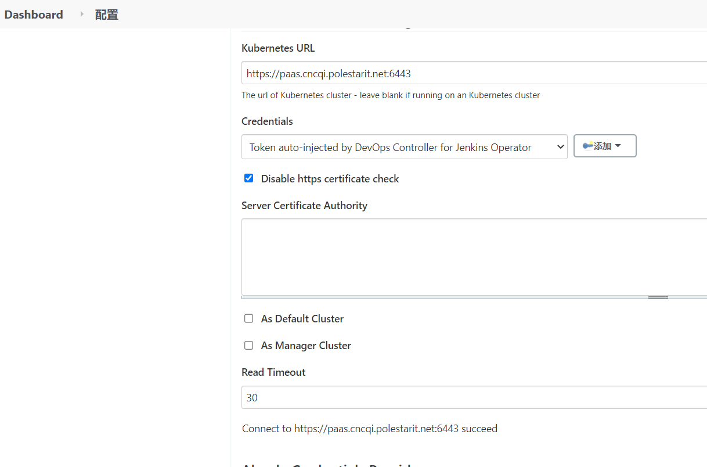

---
kind:
  - Troubleshooting
products:
  - Alauda Container Platform
  - Alauda DevOps
  - Alauda AI
  - Alauda Application Services
  - Alauda Service Mesh
  - Alauda Developer Portal
ProductsVersion:
  - 4.1.0,4.2.x
---
<!-- A type of document that involves encountering a fault, diagnosing it, performing root cause analysis, and providing solutions. -->

# 流水线更新应用阶段报错

ERROR: Unable to retrieve object markup with get You must be logged in to the server (the server has asked for the client to provide credentials (get secrets dockercfg--aecq-paas--aecq-harbor-paas)) status=1

## Cause
- 租户管理功能拦截了jenkins请求（使用k8s token缺少租户信息）

## Resolution
- 修改jenkins系统设置中调用容器平台的地址从443改为6443

## [workaround]

## [Related Information]
**Screenshots**

- Environment: TKE 3.6以上
- kubectl --server=https://paas.cncqi.polestarit.net
- secret/dockercfg--aecq-paas--aecq-harbor-paas
- jenkins系统设置
- tenat功能
- Component: 流水线
- Page ID: 127418449
- Original Title: 流水线更新应用阶段报错
