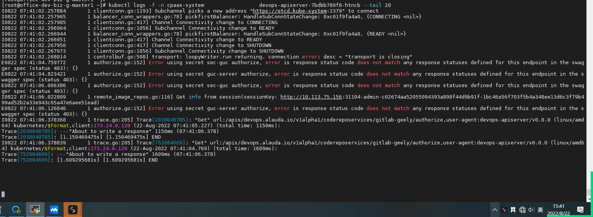
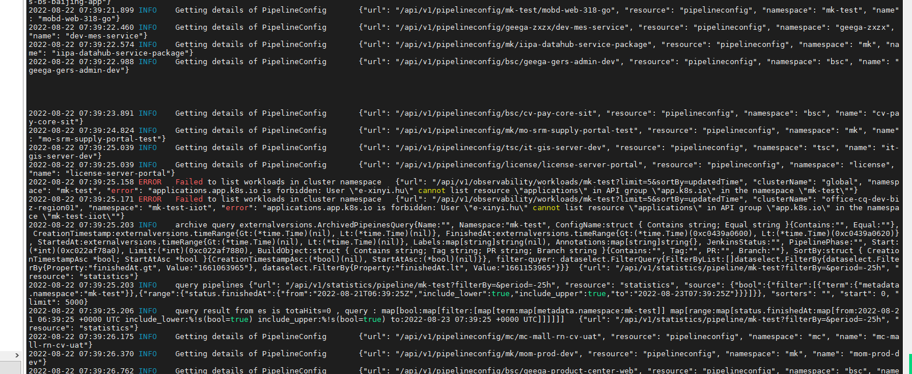

---
kind:
  - Troubleshooting
products:
  - Alauda Container Platform
  - Alauda DevOps
  - Alauda AI
  - Alauda Application Services
  - Alauda Service Mesh
  - Alauda Developer Portal
ProductsVersion:
  - 4.1.0,4.2.x
---
<!-- A type of document that involves encountering a fault, diagnosing it, performing root cause analysis, and providing solutions. -->

# 流水线点执行没反应

点击执行devops流水线无反应 f12没有报错 devops-api报错transport is closing

## Cause
- etcd宕机修复后未重建TCP连接

## Resolution
- 重启devops全组件

## [workaround]

## [Related Information]
**Screenshots**

- Environment: TKE 3.6.2
- devops-api
- devops-apiserver
- etcd
- tcp链接
- Component: 流水线
- Page ID: 127429805
- Original Title: 流水线点执行没反应
