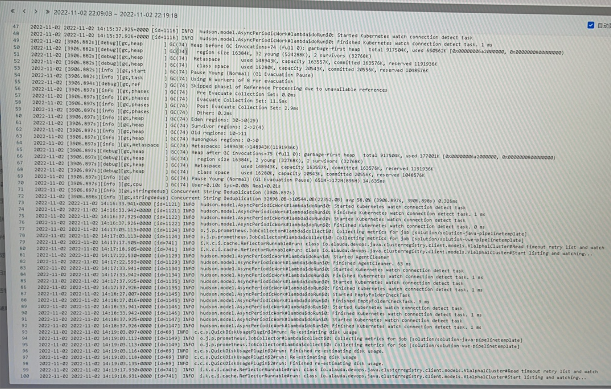
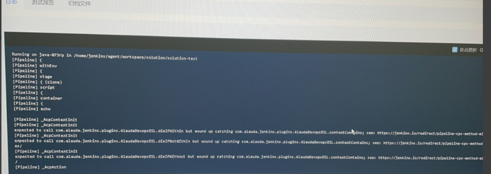
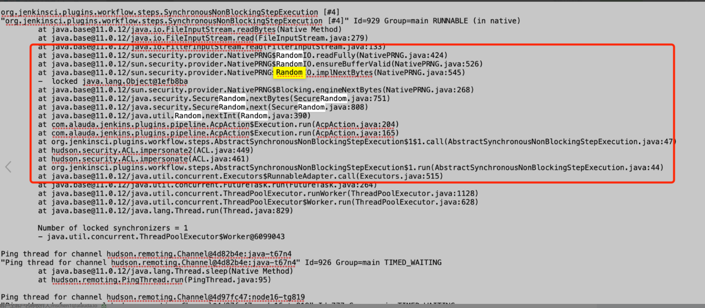

---
kind:
  - Troubleshooting
products:
  - Alauda Container Platform
  - Alauda DevOps
  - Alauda AI
  - Alauda Application Services
  - Alauda Service Mesh
  - Alauda Developer Portal
ProductsVersion:
  - 4.1.0,4.2.x
---
<!-- A type of document that involves encountering a fault, diagnosing it, performing root cause analysis, and providing solutions. -->

# 3.9

jenkins 流水线卡在clone 这一步，无法进行下一步 手动在jenkins slave节点tools容器或宿主机执行git clone成功 修改后的jenkinsfile无日志输出，流水线未执行

## Cause
- jenkins随机数导致clone步骤偶发性卡住

## Resolution
- 升级到3.10版本修复该问题

## [workaround]

## [Related Information]
**Screenshots**
3. 
5. 
8. 
- Environment: 3.9
- jenkins
- gitlab
- threadDump日志
- jenkins master pod
- jenkins slave节点
- tools容器
- Component: 流水线
- Page ID: 130550663
- Original Title: 3.9-devops-新建环境执行流水线总是在clone卡主
