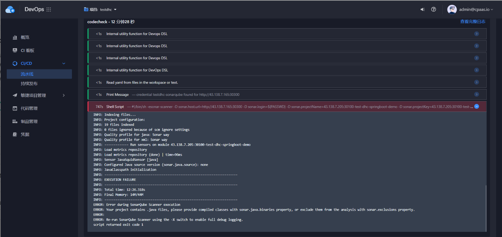
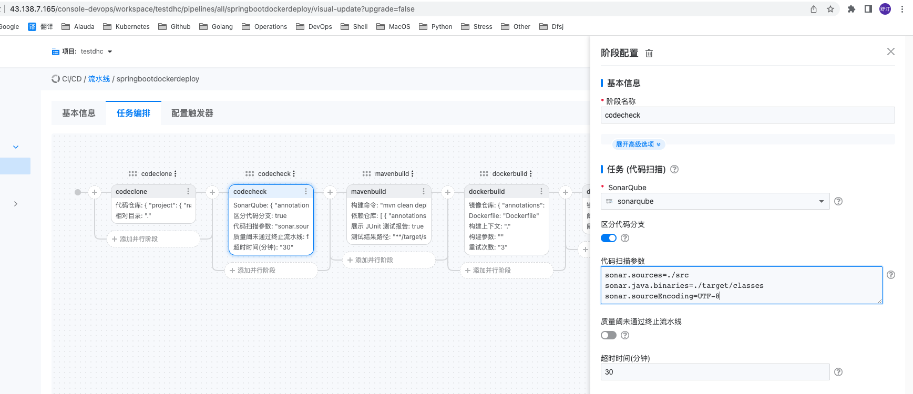

---
kind:
  - Troubleshooting
products:
  - Alauda Container Platform
  - Alauda DevOps
  - Alauda AI
  - Alauda Application Services
  - Alauda Service Mesh
  - Alauda Developer Portal
ProductsVersion:
  - 4.1.0,4.2.x
---
<!-- A type of document that involves encountering a fault, diagnosing it, performing root cause analysis, and providing solutions. -->

# 图形化流水线扫描代码失败

代码扫描失败，提示：Your project contains .java files, please provide compiled classes with sonar.java.binaries property, or exclude them from the analysis with sonar.exclusions property

## Cause
- sonar未添加参数导致默认代码扫描参数为空，未指定./src路径

## Resolution
- 在sonar配置中添加参数指定源码路径(例如：sonar.java.binaries=./src) 或 通过sonar.exclusions属性排除.java文件

## [workaround]

## [Related Information]
**Screenshots**

- Environment: TKE 3.8.1
- sonar.java.binaries
- sonar.exclusions
- 图形化流水线参数配置
- Component: 流水线
- Page ID: 130562795
- Original Title: 图形化流水线扫描代码失败
