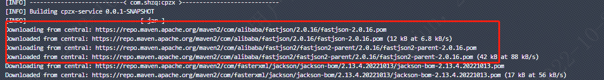
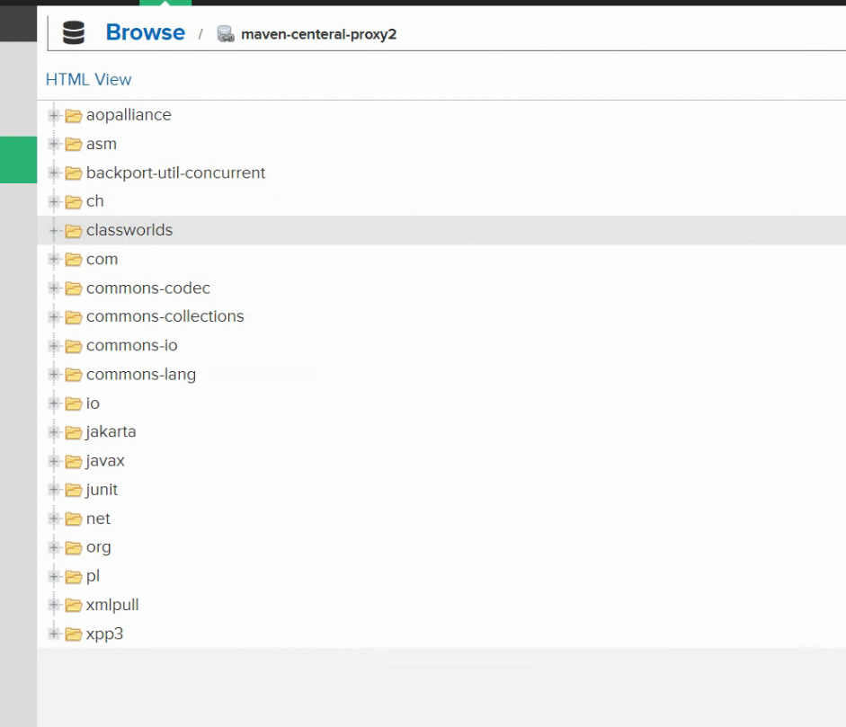

---
kind:
  - Troubleshooting
products:
  - Alauda Container Platform
  - Alauda DevOps
  - Alauda AI
  - Alauda Application Services
  - Alauda Service Mesh
  - Alauda Developer Portal
ProductsVersion:
  - 4.1.0,4.2.x
---
<!-- A type of document that involves encountering a fault, diagnosing it, performing root cause analysis, and providing solutions. -->

# nexus 中没有保存流水线新下载的依赖包

流水线下载依赖时使用proxy2地址（https://repo.maven.apache.org/maven2/）而非配置的proxy1地址（https://repo1.maven.org/maven2/） 新下载的依赖包未在nexus中保存

## Cause
- 未配置settings.xml文件导致maven客户端未通过nexus代理
- maven客户端直接连接公网仓库（https://repo.maven.apache.org/maven2/）下载依赖

## Resolution
- 添加包含nexus代理配置的settings.xml文件

## [workaround]

## [Related Information]
**Screenshots**

- Environment: TKE
- settings.xml
- public仓库配置
- proxy1地址(https://repo1.maven.org/maven2/)
- proxy2地址(https://repo.maven.apache.org/maven2/)
- maven镜像配置
- Component: 流水线
- Page ID: 130576425
- Original Title: nexus 中没有保存流水线新下载的依赖包
