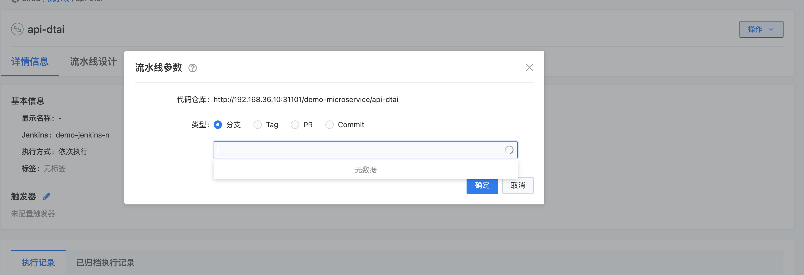

---
kind:
  - Troubleshooting
products:
  - Alauda Container Platform
  - Alauda DevOps
  - Alauda AI
  - Alauda Application Services
  - Alauda Service Mesh
  - Alauda Developer Portal
ProductsVersion:
  - 4.1.0,4.2.x
---
<!-- A type of document that involves encountering a fault, diagnosing it, performing root cause analysis, and providing solutions. -->

# 执行流水线无法选择分支

执行流水线无法选择分支

## Cause
- 旧gitlab迁移后凭据权限异常导致集成资源异常

## Resolution
- 在新gitlab中集成repo
- 流水线配置中切换至新gitlab集成资源
- 删除旧gitlab集成资源

## [workaround]

## [Related Information]
**Screenshots**

- Environment: TKE 3.8
- gitlab集成资源
- 流水线配置
- 凭据权限
- Component: 流水线
- Page ID: 130576613
- Original Title: 执行流水线无法选择分支
