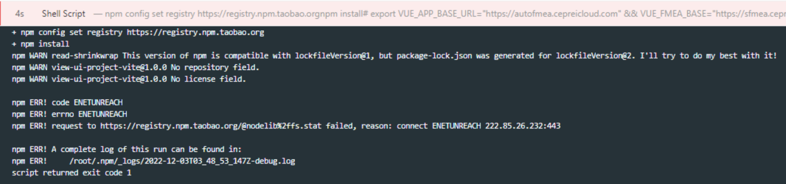

---
kind:
  - Troubleshooting
products:
  - Alauda Container Platform
  - Alauda DevOps
  - Alauda AI
  - Alauda Application Services
  - Alauda Service Mesh
  - Alauda Developer Portal
ProductsVersion:
  - 4.1.0,4.2.x
---
<!-- A type of document that involves encountering a fault, diagnosing it, performing root cause analysis, and providing solutions. -->

# nodejs构建阶段拉取公共镜像源失败

devops-nodejs构建阶段拉取公共镜像源失败 1、检查所有节点本地是否可正常访问此地址，检查结果确认现场其中一台新添加的slave节点，无法访问此外部地址，确认问题原因

## Cause

## Resolution
- ## 解决方案
- 临时解决方法，通过集群管理临时关闭此问题节点调度能力，重新执行流水线恢复
- 最终解决：客户底层对此节点开通此地址网络权限

## [workaround]

## [Related Information]
**Screenshots**

- 12
- 18
- /devops-nodejsgou-jian-jie-duan-la-qu-gong-gong-jing-xiang-yuan-shi-bai/image2022-12-6_10-8-18.png
- Component: 流水线
- Page ID: 133072520
- Original Title: devops-nodejs构建阶段拉取公共镜像源失败
