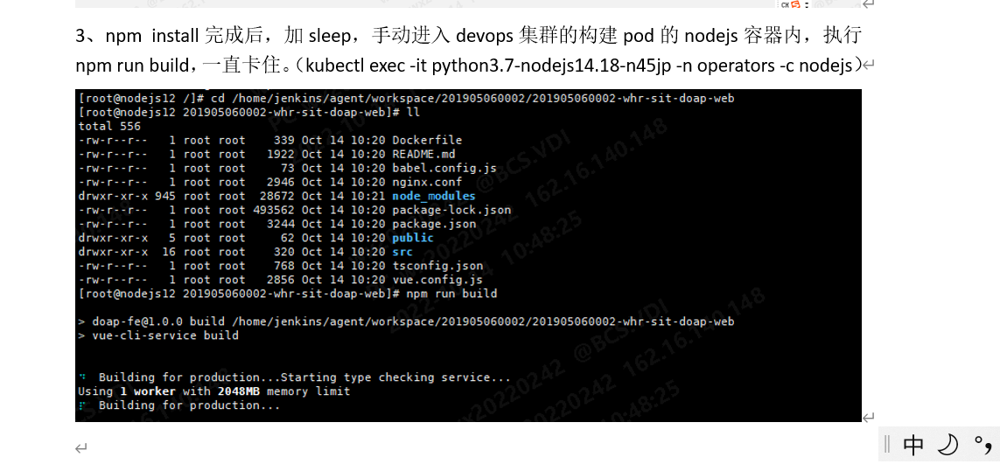

---
kind:
  - Troubleshooting
products:
  - Alauda Container Platform
  - Alauda DevOps
  - Alauda AI
  - Alauda Application Services
  - Alauda Service Mesh
  - Alauda Developer Portal
ProductsVersion:
  - 4.1.0,4.2.x
---
<!-- A type of document that involves encountering a fault, diagnosing it, performing root cause analysis, and providing solutions. -->

# nodejs流水线构建阶段build卡死

构建阶段build卡死 缺少index和getCookie两个module Linux本地构建存在相同问题

## Cause
- 使用了错误的构建命令npm run build

## Resolution
- 改用npm run build:test命令
- 使用官方nodejs模板打包验证

## [workaround]
- 更换为TKE提供的nodejs官方image

## [Related Information]
**Screenshots**

- Environment: 通用
- npm run build
- npm run build:test
- nodejs镜像
- Component: 流水线
- Page ID: 133074930
- Original Title: nodejs流水线构建阶段build卡死
