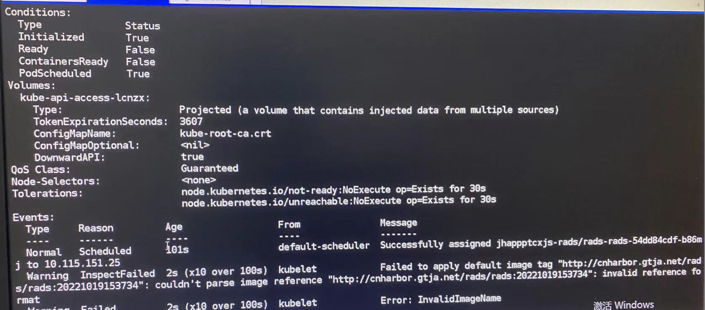

---
kind:
  - Troubleshooting
products:
  - Alauda Container Platform
  - Alauda DevOps
  - Alauda AI
  - Alauda Application Services
  - Alauda Service Mesh
  - Alauda Developer Portal
ProductsVersion:
  - 4.1.0,4.2.x
---
<!-- A type of document that involves encountering a fault, diagnosing it, performing root cause analysis, and providing solutions. -->

# 流水线发布应用阶段报错invalid image

流水线发布应用阶段报错invalid image

## Cause
- 镜像构建阶段输入框误添加https://前缀导致生成错误image名称

## Resolution
- 删除镜像名称中的https://前缀后重新运行流水线

## [workaround]

## [Related Information]
**Screenshots**

- Environment: TKE 3.8.2
- 镜像构建配置
- deploy.yaml image字段
- Component: 流水线
- Page ID: 133075553
- Original Title: 流水线发布应用阶段报错invalid image
