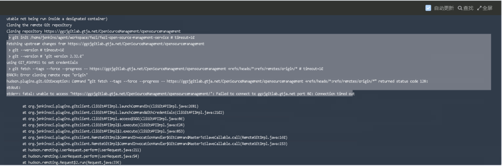

---
kind:
  - Troubleshooting
products:
  - Alauda Container Platform
  - Alauda DevOps
  - Alauda AI
  - Alauda Application Services
  - Alauda Service Mesh
  - Alauda Developer Portal
ProductsVersion:
  - 4.1.0,4.2.x
---
<!-- A type of document that involves encountering a fault, diagnosing it, performing root cause analysis, and providing solutions. -->

# 流水线git fetch拉取不到代码

git fetch connection timed out redirect to GitLab's internal HTTP URL which is unreachable

## Cause
- GitLab's clone URL mismatch with pipeline configuration
- F5 HTTPS reverse proxy causing redirect to internal HTTP GitLab

## Resolution
- Ensure pipeline configuration URL matches GitLab's git clone URL exactly

## [workaround]

## [Related Information]
**Screenshots**

- Environment: TKE 3.8
- F5 reverse proxy
- GitLab clone URL
- pipeline configuration address
- Component: 流水线
- Page ID: 133083578
- Original Title: 流水线git fetch拉取不到代码
