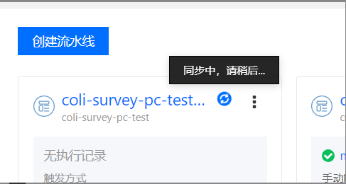
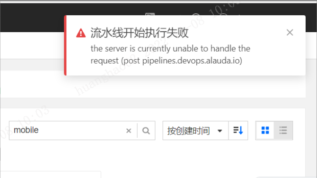
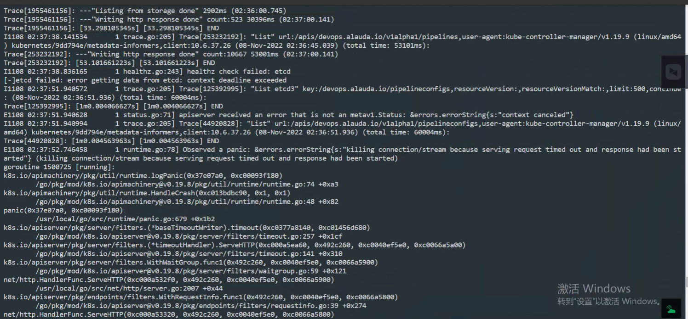
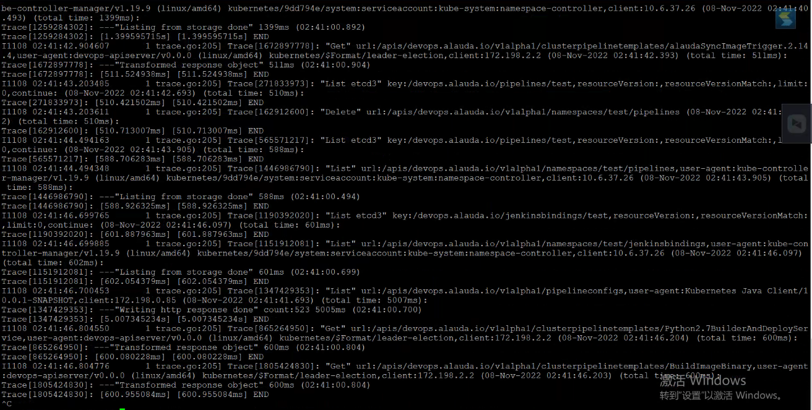

---
kind:
  - Troubleshooting
products:
  - Alauda Container Platform
  - Alauda DevOps
  - Alauda AI
  - Alauda Application Services
  - Alauda Service Mesh
  - Alauda Developer Portal
ProductsVersion:
  - 4.1.0,4.2.x
---
<!-- A type of document that involves encountering a fault, diagnosing it, performing root cause analysis, and providing solutions. -->

# 3.4.2

更新流水线页面报错: the server is currently unable to handle the request (post pipelines.devops.alauda.io)

## Cause
- devops-apiserver组件处理devops组API资源查询时间过长
- 日志中存在异常抛出

## Resolution
- 重启devops-apiserver组件
- 检查并优化API资源查询性能

## [workaround]
- 立即重启devops-apiserver组件

## [Related Information]
**Screenshots**

- Environment: TKE 3.4.2
- devops-apiserver
- pipelines.devops.alauda.io CRD
- kubernetes API server
- Component: 流水线
- Page ID: 133086229
- Original Title: 3.4.2-流水线更新失败
