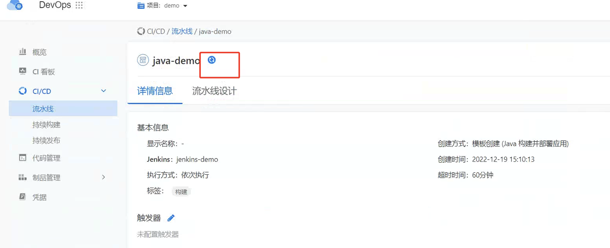

---
kind:
  - Troubleshooting
products:
  - Alauda Container Platform
  - Alauda DevOps
  - Alauda AI
  - Alauda Application Services
  - Alauda Service Mesh
  - Alauda Developer Portal
ProductsVersion:
  - 4.1.0,4.2.x
---
<!-- A type of document that involves encountering a fault, diagnosing it, performing root cause analysis, and providing solutions. -->

# 流水线一直处于同步中

流水线一直处于同步中 Jenkins日志显示超时 Jenkins无法连接VIP地址

## Cause
- Jenkins所在子网处于删除状态导致网络中断

## Resolution
- 手动删除问题子网
- 重启Jenkins Pod

## [workaround]

## [Related Information]
**Screenshots**
h

- Environment: 3.10.1
- Jenkins
- subnet
- VIP
- Kubernetes Pod
- Component: 流水线
- Page ID: 133094413
- Original Title: devops-流水线一直处于同步中
