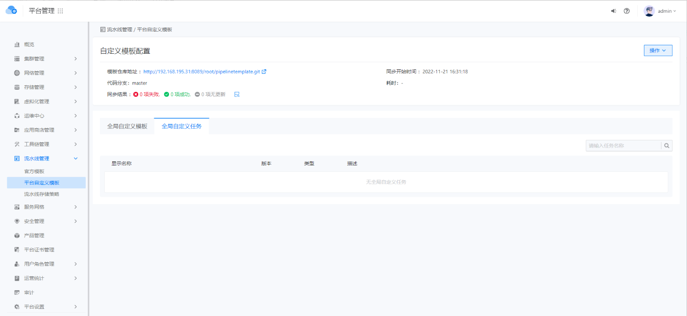
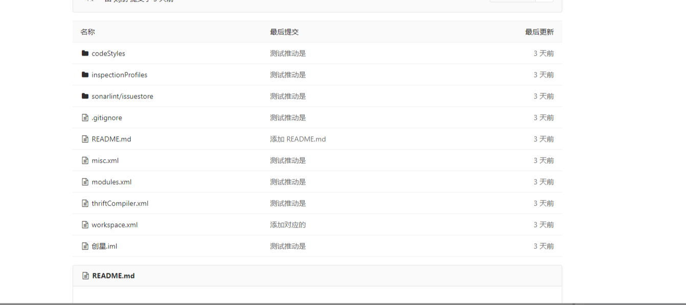

---
kind:
  - Troubleshooting
products:
  - Alauda Container Platform
  - Alauda DevOps
  - Alauda AI
  - Alauda Application Services
  - Alauda Service Mesh
  - Alauda Developer Portal
ProductsVersion:
  - 4.1.0,4.2.x
---
<!-- A type of document that involves encountering a fault, diagnosing it, performing root cause analysis, and providing solutions. -->

# 流水线自定义模板同步失败

同步完成后自定模版无数据

## Cause
- pipelinetemplate CR yaml未放置在GitLab仓库父目录
- Git仓库地址结尾包含.git后缀

## Resolution
- 将自定义pipelinetemplate yaml文件放置在Git仓库父目录
- 移除Git仓库地址的.git后缀

## [workaround]
- 使用内部提供的pipelinetemplate CR yaml进行同步验证

## [Related Information]
**Screenshots**

- Environment: TKE 3.10
- pipelinetemplate CR yaml
- GitLab repo
- Component: 流水线
- Page ID: 133095031
- Original Title: 流水线自定义模板同步失败
